<div align="center">

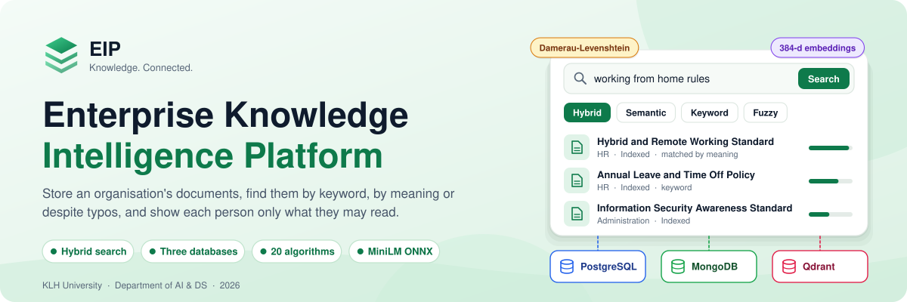

<br><br>

[](https://github.com/SathyaMaragani/Enterprise-Knowledge-Intelligence-Platform/actions/workflows/backend.yml)
[](https://github.com/SathyaMaragani/Enterprise-Knowledge-Intelligence-Platform/actions/workflows/frontend.yml)
[](https://ekipsearch.vercel.app)


**[Live demo](https://ekipsearch.vercel.app)** &nbsp;·&nbsp;
**[Screenshots](#screenshots)** &nbsp;·&nbsp;
**[Architecture](#architecture)** &nbsp;·&nbsp;
**[Getting started](#getting-started)** &nbsp;·&nbsp;
**[Full documentation](docs/PROJECT_OVERVIEW.md)** &nbsp;·&nbsp;
**[Review decks](#documentation-and-reviews)**

</div>

<br>

<p align="center">
  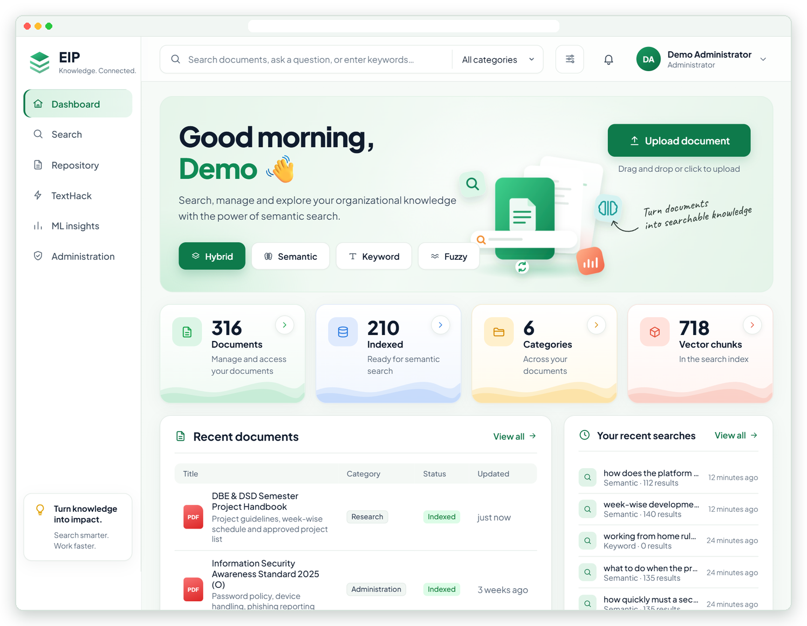
</p>

## About

Organisations keep their knowledge in documents: policies, procedures, runbooks, contracts and research notes. Three things go wrong:

1. **People can't find them.** A search for "rules for working from home" misses a policy titled *Hybrid and Remote Working Standard*.
2. **Typing mistakes defeat search.** "remte workng standrd" finds nothing in a plain keyword search.
3. **Not everyone may see everything.** A search that shows a restricted title, or even counts it, is already a leak.

EIP answers all three. It searches **by meaning** with sentence embeddings, **by typo-tolerant keyword** with string algorithms written from scratch, and applies **one permission rule to every result before ranking**. Each kind of data lives in the database built for it, and an upload either lands in all three stores or in none.

It is one integrated project built across four courses. Each course owns a part of the system, and the parts meet in one running product.

<table>
  <tr>
    <td width="33%" valign="top"><b>Four search modes</b><br><sub>Hybrid, semantic, keyword and fuzzy, with filters, paging and the signals that matched each result.</sub></td>
    <td width="33%" valign="top"><b>Three databases, one id</b><br><sub>PostgreSQL for identity and metadata, MongoDB for text and chunks, Qdrant for embeddings, all keyed by the PostgreSQL document id.</sub></td>
    <td width="33%" valign="top"><b>Access control on every result</b><br><sub>JWT sign-in, three roles, and per-document read grants checked before anything is ranked or counted.</sub></td>
  </tr>
  <tr>
    <td valign="top"><b>PDF, Word, text and Markdown</b><br><sub>Up to 10 MB. Text is extracted, split into overlapping chunks and embedded when you upload.</sub></td>
    <td valign="top"><b>Algorithms from first principles</b><br><sub>KMP, Aho-Corasick and Damerau-Levenshtein score keyword search, and a workbench runs them live.</sub></td>
    <td valign="top"><b>Runs on free tiers</b><br><sub>Vercel, Render Free (512 MB), Neon, MongoDB Atlas and Qdrant Cloud, tuned to answer in under a second.</sub></td>
  </tr>
</table>

## Screenshots

<table>
  <tr>
    <td width="50%" valign="top">
      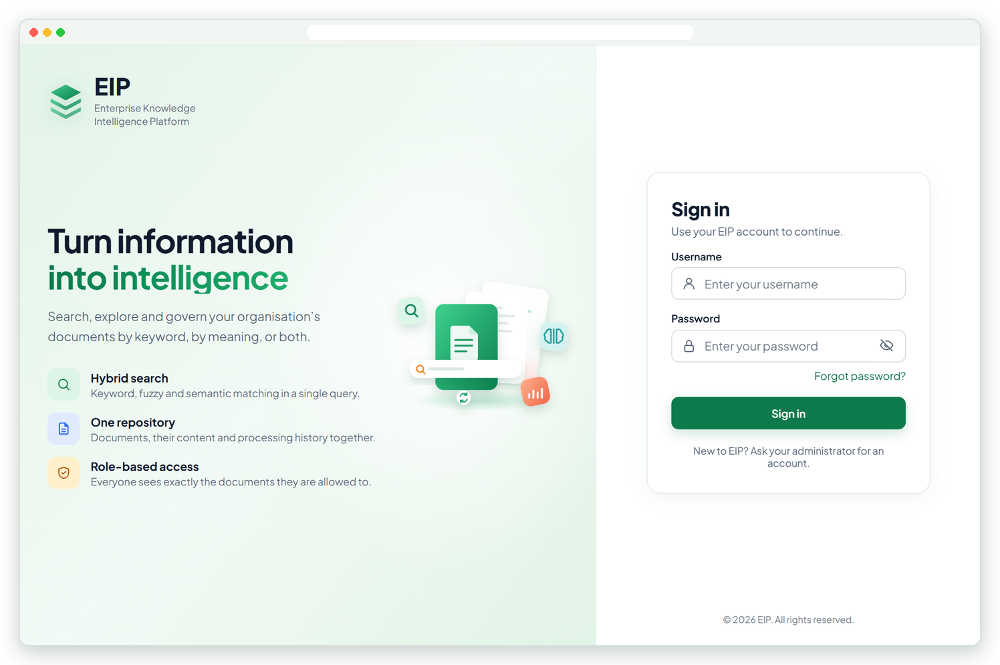
      <p align="center"><b>Sign-in</b><br><sub>Username and password, then a JWT session. Accounts are created by an administrator.</sub></p>
    </td>
    <td width="50%" valign="top">
      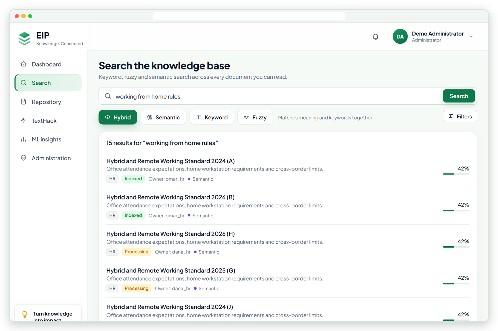
      <p align="center"><b>Search by meaning</b><br><sub>"working from home rules" finds the <i>Hybrid and Remote Working Standard</i>, which shares none of those words.</sub></p>
    </td>
  </tr>
  <tr>
    <td valign="top">
      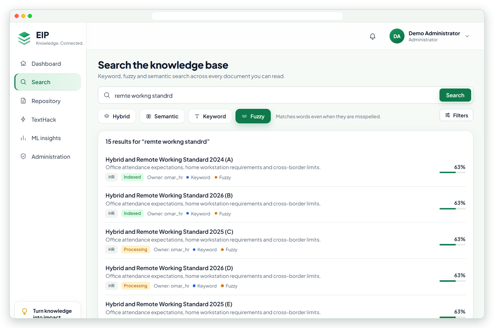
      <p align="center"><b>Search despite typos</b><br><sub>"remte workng standrd" still finds the standard, through Damerau-Levenshtein edit distance.</sub></p>
    </td>
    <td valign="top">
      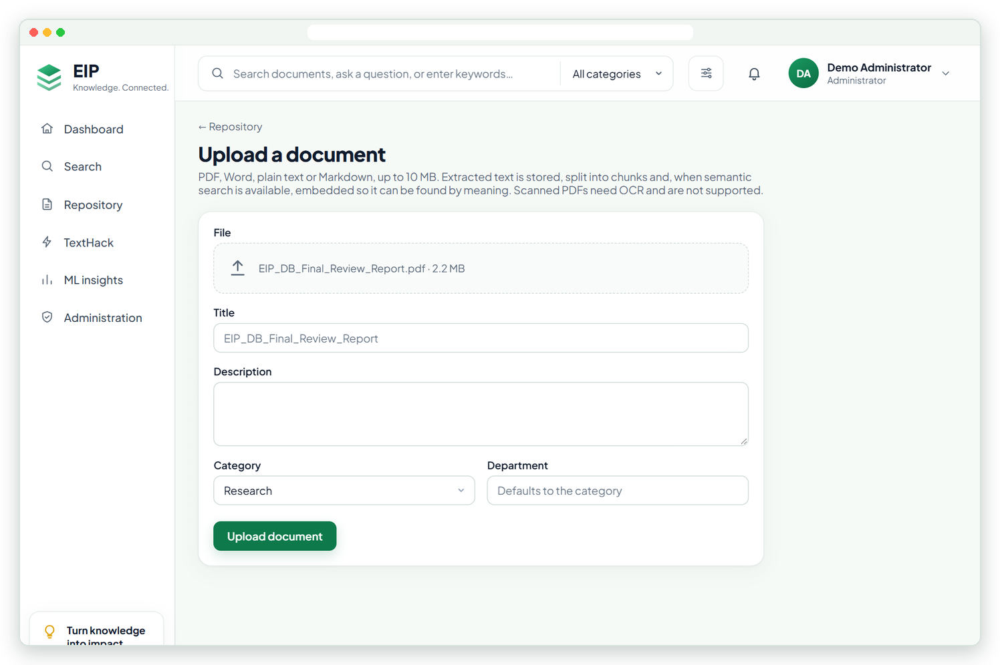
      <p align="center"><b>Upload</b><br><sub>PDF, Word, text or Markdown, with title, description, category and department.</sub></p>
    </td>
  </tr>
  <tr>
    <td valign="top">
      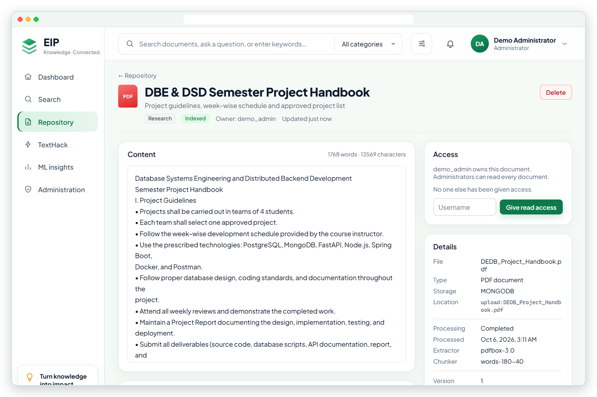
      <p align="center"><b>Document viewer</b><br><sub>Extracted text, chunks, processing details and sharing for an uploaded PDF.</sub></p>
    </td>
    <td valign="top">
      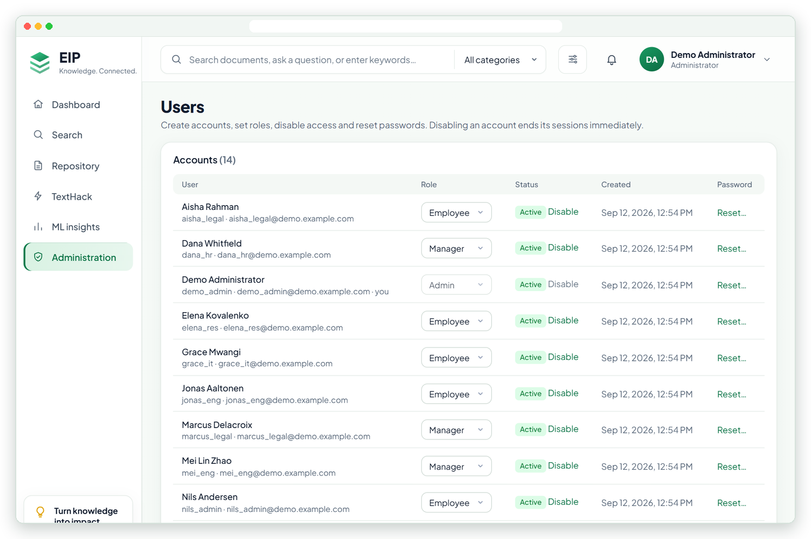
      <p align="center"><b>Administration</b><br><sub>Create accounts, change roles, disable access and reset passwords.</sub></p>
    </td>
  </tr>
  <tr>
    <td valign="top">
      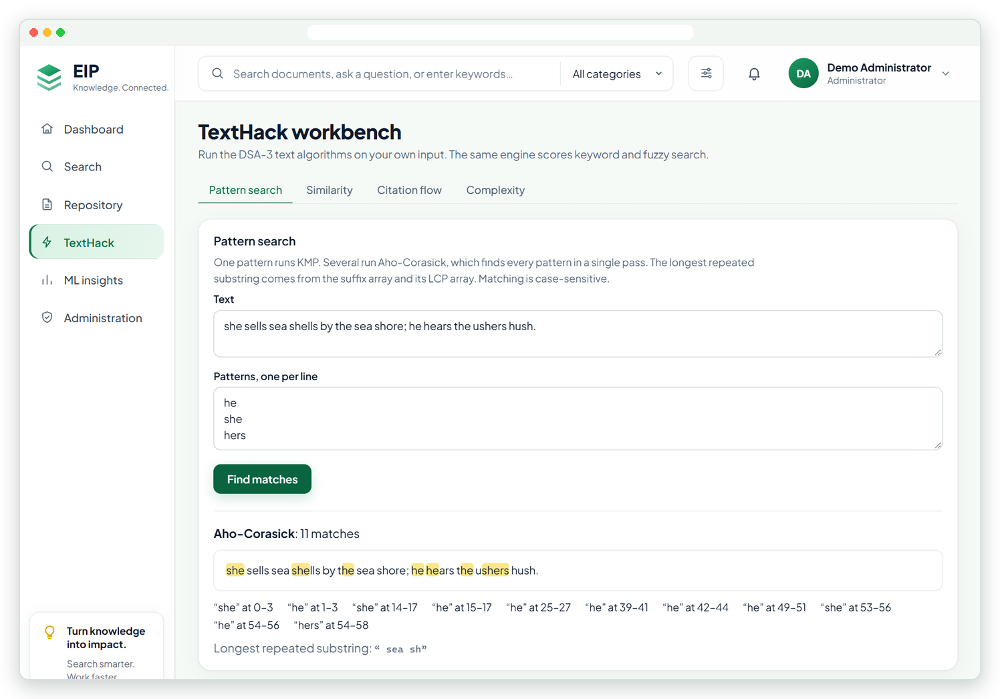
      <p align="center"><b>TextHack workbench</b><br><sub>Aho-Corasick finds all 11 matches of three patterns in one pass; similarity, citation flow and complexity sit alongside.</sub></p>
    </td>
    <td valign="top">
      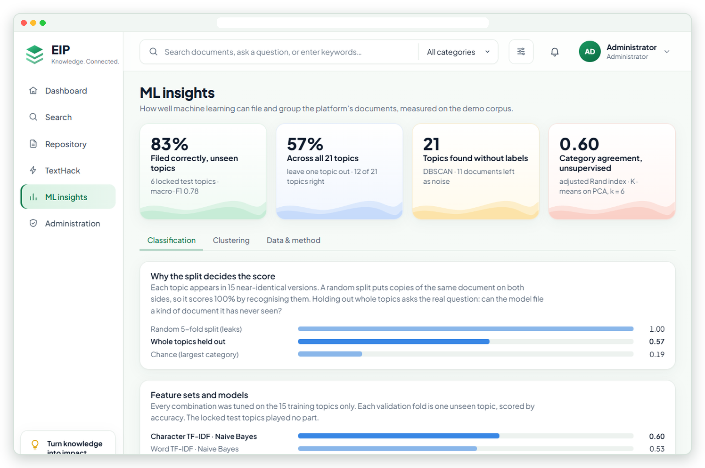
      <p align="center"><b>ML insights</b><br><sub>How well documents can be filed and grouped automatically, measured on the demo corpus.</sub></p>
    </td>
  </tr>
</table>

<sub>Screenshots are from the local demo stack: 315 generated documents and 14 users, plus one uploaded PDF. The live site holds its own data.</sub>

## One platform, four subjects

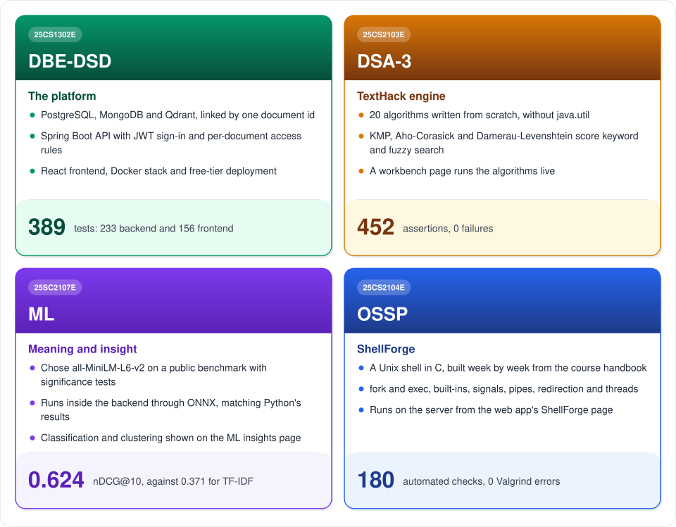

| Subject | Course | What it contributes | Details |
|---|---|---|---|
| **DBE-DSD** | Database Systems Engineering and Distributed Backend Development (25CS1302E) | The three databases, the Spring Boot API, security, the React frontend, containers and deployment | [DBE-DSD.md](docs/database/DBE-DSD.md) |
| **DSA-3** | Data Structures and Algorithms 3 (25CS2103E) | TextHack, compiled into the backend: it scores every keyword and fuzzy search and powers the workbench | [DSA-3.md](docs/algorithms/DSA-3.md) |
| **ML** | Machine Learning (25SC2107E) | The embedding model choice and its Java parity, the chunking rule, the demo corpus, classification and clustering | [ML.md](docs/ml/ML.md) |
| **OSSP** | Operating Systems and Systems Programming (25CS2104E) | ShellForge, a Unix shell in C. It is a standalone component, not yet called by the platform | [OSSP.md](docs/ossp/OSSP.md) |

## Architecture

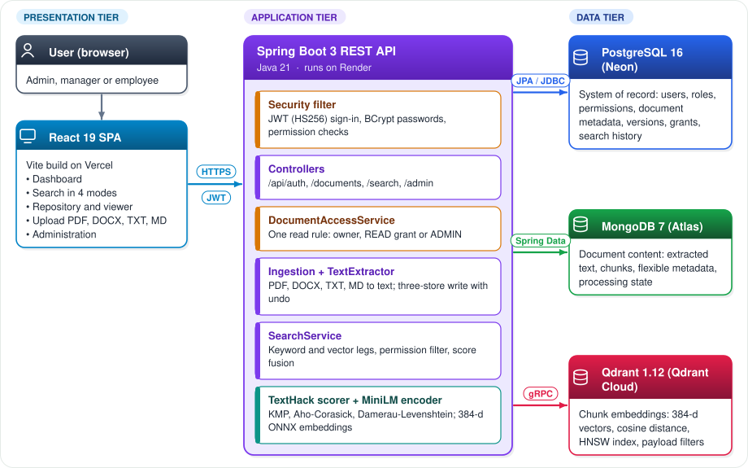

- **One origin.** Vercel serves the React build and forwards `/api/*` to Render, so the browser never needs CORS.
- **No model server.** `all-MiniLM-L6-v2` runs inside the backend through ONNX Runtime and produces 384-dimensional vectors.
- **Each store does one job.** PostgreSQL is the system of record; MongoDB holds the extracted text and chunks; Qdrant holds one vector per chunk.

### How search works

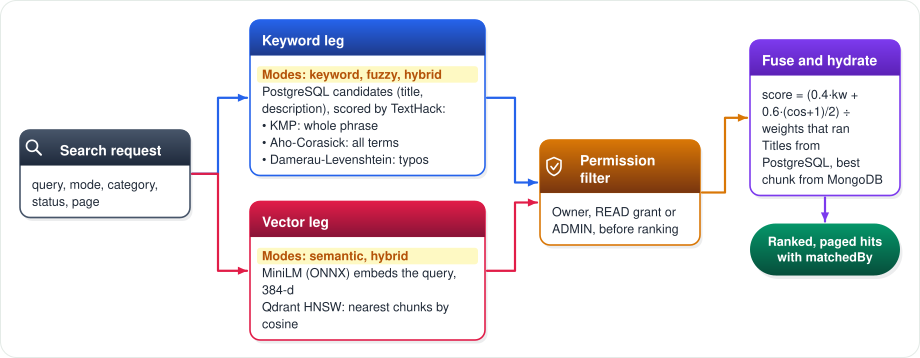

Keyword matching reads the title, the description and the document's full text, so a word that appears only in the body still counts. Each result's score is `(0.4 × keyword + 0.6 × (cosine + 1) / 2)`, divided by the weights of the legs that ran. A document found by meaning alone must reach a minimum similarity, so unrelated documents are left out instead of being listed with a low score. Restricted documents are removed **before** ranking, so they never affect a count or a position.

| Mode | Finds documents by |
|---|---|
| Hybrid (default) | Keyword and meaning together |
| Semantic | Meaning only |
| Keyword | Exact words, in any order |
| Fuzzy | Words with typing mistakes too |

### Uploading a document

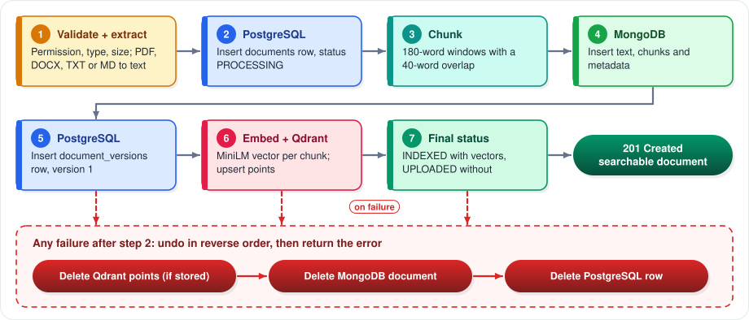

The upload is a small saga: if any step after the first database write fails, the earlier writes are undone in reverse order, so no store is left with half a document.

### Data model

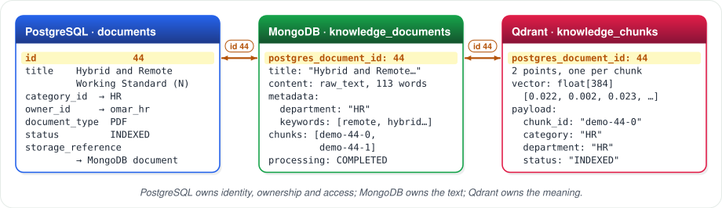

Every document has one identity: its PostgreSQL id. MongoDB stores it as `postgres_document_id` and every Qdrant point carries it in its payload, so the three stores join on the same key.

<details>
<summary><b>PostgreSQL schema: 12 tables</b></summary>

<br>

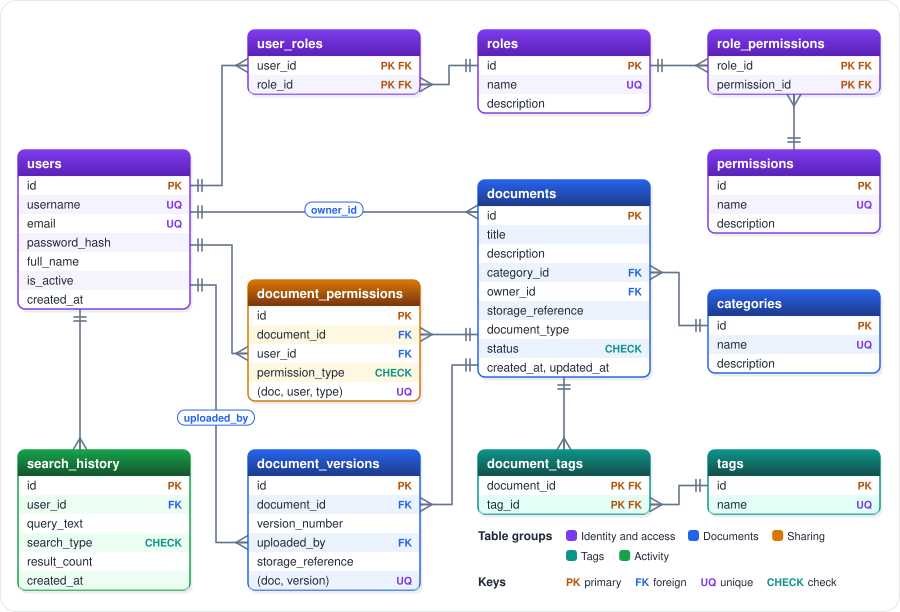

Full column-level detail is in the [data dictionary](subjects/DBE-DSD/database/postgresql/docs/DATA_DICTIONARY.md).

</details>

### Security

<p align="center">
  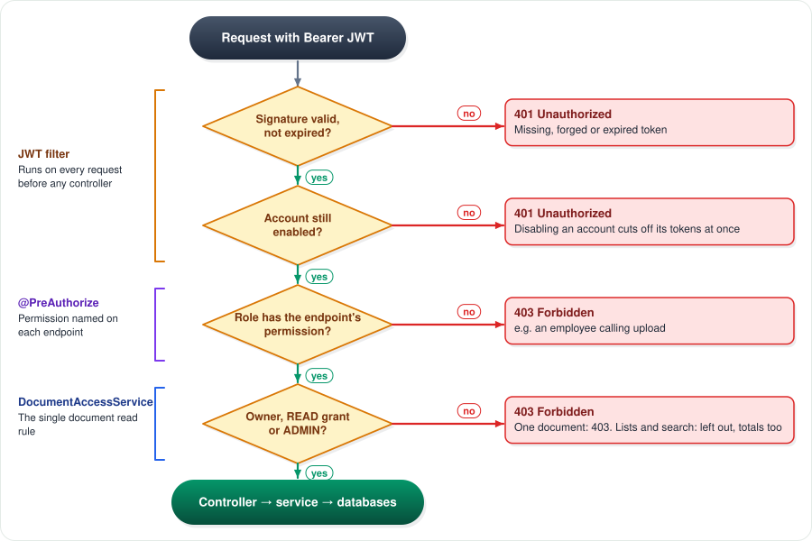
</p>

- **Passwords** are BCrypt hashes, and a failed sign-in never reveals whether the account exists.
- **Tokens** are HS256 JWTs valid for 24 hours and only while the account is enabled. The signing secret has no default.
- **Permissions, not role names,** guard every endpoint: ADMIN holds all six, MANAGER create, read and update, EMPLOYEE read.
- **Uploads** are capped at 10 MB, with XML external entities disabled and a 64 MB unzip limit for Word files.
- **No secrets in the repository:** every credential comes from environment variables.

## Results

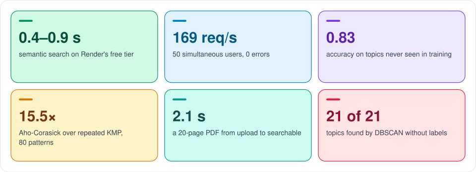

| Area | What is tested | Result |
|---|---|---|
| Backend | Unit tests, plus integration tests on live PostgreSQL, MongoDB and Qdrant | **205 pass** (201 in GitHub Actions on every change) |
| Frontend | 16 Vitest files: pages, session, API client | **149 pass** |
| Full stack | Smoke test through nginx; load test with 50 users for 30 s | **28 / 28**; **169 req/s, 0 errors** |
| DSA-3 | Six self-checking suites with 4,000 randomised cross-checks | **452 assertions**, 0 failures |
| ML | Pipeline, embeddings, Java and Python parity, retrieval equivalence | Java and Python top-5 results **100% identical** |
| OSSP | Weekly suites plus Valgrind, GDB and sanitizers | **148 checks** pass |

## Tech stack

| Layer | Technology |
|---|---|
| Frontend | React 19, React Router 7, Vite 8, Vitest |
| Backend | Java 21, Spring Boot 3.4, Spring Security (JWT, BCrypt), Spring Data JPA and MongoDB, Apache PDFBox 3 |
| Search | TextHack engine (DSA-3) for keyword and fuzzy scoring; `all-MiniLM-L6-v2` on ONNX Runtime, in-process |
| Data | PostgreSQL 16, MongoDB 7, Qdrant 1.12 |
| ML research | Python, scikit-learn, sentence-transformers, PyTorch |
| Systems | C with gcc 13, Make, Valgrind, GDB |
| Delivery | Docker Compose, GitHub Actions, Vercel, Render Free, Neon, MongoDB Atlas, Qdrant Cloud |

## Getting started

**Try it online:** open **[ekipsearch.vercel.app](https://ekipsearch.vercel.app)**. The free backend keeps itself awake, so it normally answers at once; just after a deploy, the first visit can take up to two minutes while it starts. There is no self sign-up: an administrator creates accounts.

**Run the whole stack locally** (needs Docker):

```bash
cd subjects/DBE-DSD/docker
cp .env.example .env    # then fill in JWT_SECRET, the database passwords and the first administrator
docker compose up -d --build --wait
```

Then open http://localhost:8088. See [docker/README.md](subjects/DBE-DSD/docker/README.md) for the smoke and load tests.

<details>
<summary><b>Run each part on its own</b></summary>

<br>

| Part | Commands |
|---|---|
| Backend tests | Start the test databases with `docker compose -f subjects/DBE-DSD/database/docker-compose.test.yml up -d --wait`, fetch the model with `backend/model/fetch-model.sh`, then run `./mvnw test` with the environment in [TESTING.md](subjects/DBE-DSD/backend/docs/TESTING.md) |
| Frontend | `cd subjects/DBE-DSD/frontend && npm install && npm run dev` (Vite proxies `/api` to `http://localhost:8080`); `npm test` runs the suite |
| TextHack (DSA-3) | `cd subjects/DSA-3 && sh run-tests.sh`, then `java -cp out examples.Demos` or `java -cp out benchmarks.Benchmark` |
| ML | `cd subjects/ML && pip install -r requirements.txt`, then the commands in [ML.md](docs/ml/ML.md#8-tests) |
| ShellForge (OSSP) | `cd subjects/OSSP/shellforge && docker run --rm -v "$(pwd):/src" -w /src gcc:13 sh -c "make clean && make test"` |

</details>

## Repository layout

```
enterprise-knowledge-intelligence/
├── docs/
│   ├── PROJECT_OVERVIEW.md       the whole project in one document
│   ├── database/  algorithms/  ml/  ossp/   one document per subject
│   ├── presentations/            review decks and the DB final report
│   ├── screenshots/  readme/     images used on this page
│   └── architecture/             architecture and ONNX notes
├── subjects/
│   ├── DBE-DSD/   database/ (PostgreSQL, MongoDB, Qdrant, demo data), backend/ (Spring Boot),
│   │              frontend/ (React), docker/ (full stack, smoke and load tests), deploy/
│   ├── DSA-3/     texthack/ engine, tests/, benchmarks/, examples/
│   ├── ML/        src/, tests/, notebooks/, results/, docs/
│   └── OSSP/      shellforge/ (src/, include/, tests/, docs/WEEK1..9.md)
├── .github/workflows/            Backend and Frontend CI
└── render.yaml                   Render Blueprint for the backend
```

## Limitations and roadmap

| Today | Next step |
|---|---|
| Body matching is exact (no typo tolerance) and scans every body in MongoDB | Take candidates from the `content.raw_text` text index or Atlas Search |
| Restricted users can get fewer semantic hits, because permissions are applied after Qdrant's top-K | Pass the readable ids to Qdrant as a payload filter |
| No OCR for scanned PDFs | Add an OCR step to text extraction |
| Embedding runs inside the upload request | Move it to a background job for large files |
| ML results are displayed, not served | Suggest a category when a document is uploaded |
| ShellForge runs on its own | Job control, FIFOs, shared memory and threads from the rest of the OSSP syllabus |

## Documentation and reviews

| Document | What it covers |
|---|---|
| [Project overview](docs/PROJECT_OVERVIEW.md) | Everything in one place: problem, flows, data model, security, deployment, timeline, limitations |
| [DBE-DSD](docs/database/DBE-DSD.md) · [DSA-3](docs/algorithms/DSA-3.md) · [ML](docs/ml/ML.md) · [OSSP](docs/ossp/OSSP.md) | What each subject built, how it was tested, and how it maps to the course outcomes |
| [REST API](subjects/DBE-DSD/backend/docs/API.md) · [Backend tests](subjects/DBE-DSD/backend/docs/TESTING.md) | Endpoint reference and how to run the backend suite |
| [Deployment](subjects/DBE-DSD/deploy/README.md) | Free-tier deployment on Vercel, Render, Neon, Atlas and Qdrant Cloud |

**Review presentations** ([index with dates](docs/PROJECT_OVERVIEW.md#review-presentations-and-reports)):

| Subject | Files |
|---|---|
| DBE-DSD | [Review 1](docs/presentations/DBE-DSD/DBE-DSD-Review-1.pptx) · [Review 2](docs/presentations/DBE-DSD/DBE-DSD-Review-2.pptx) · Final report ([PDF](docs/presentations/DBE-DSD/DBE-DSD-Final-Review-Report.pdf), [Word](docs/presentations/DBE-DSD/DBE-DSD-Final-Review-Report.docx)) |
| DSA-3 | [Review 1](docs/presentations/DSA-3/DSA-3-Review-1.pptx) · [Review 2: TextHack](docs/presentations/DSA-3/DSA-3-Review-2-TextHack.pptx) |
| ML | [Project review](docs/presentations/ML/ML-Review.pptx) |
| OSSP | [Review 1](docs/presentations/OSSP/OSSP-Review-1-ShellForge.pptx) · [Review 2: Weeks 1–6](docs/presentations/OSSP/OSSP-Review-2-ShellForge-Weeks1-6.pptx) |

## Team

| Name | Roll number |
|---|---|
| M. Sathya Krishna | 2510080006 |
| Yashwanth | 2510080001 |
| Aneeq | 2510080005 |
| Abhinav | 2510080002 |

