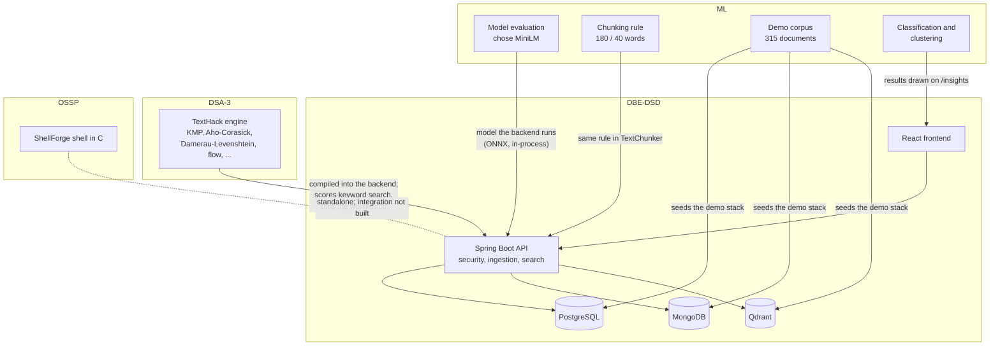
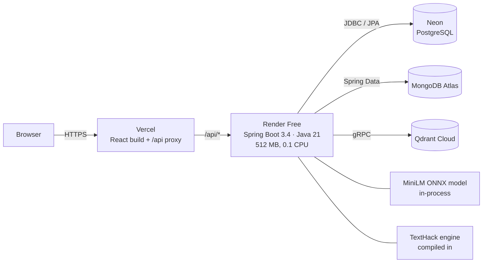
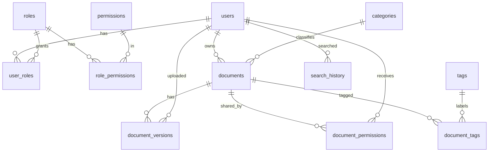
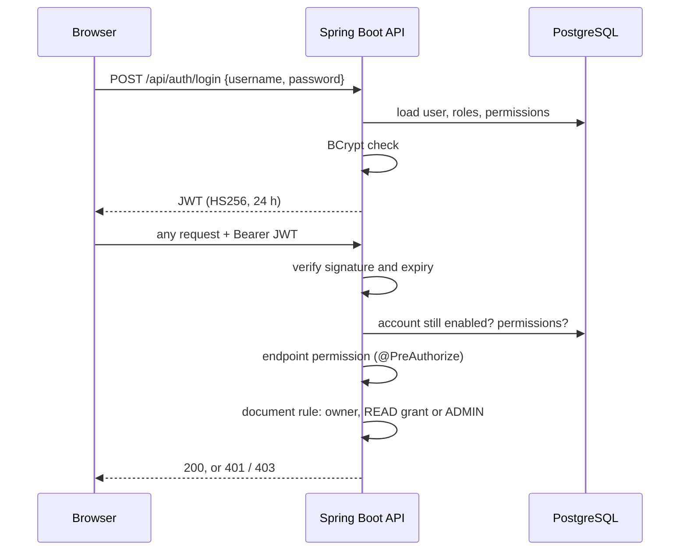
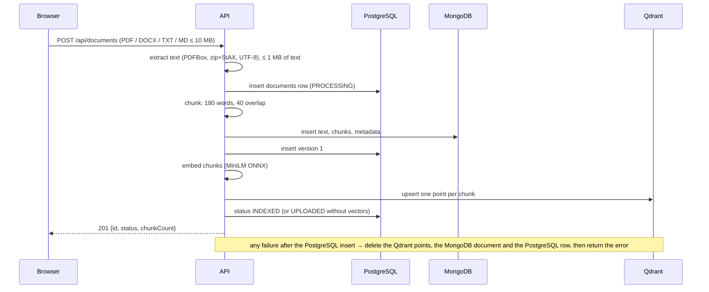
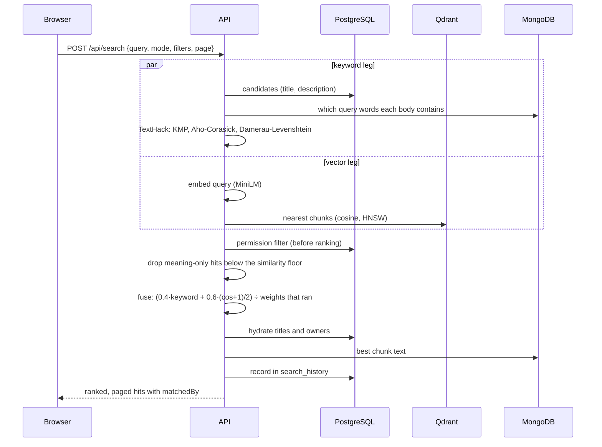
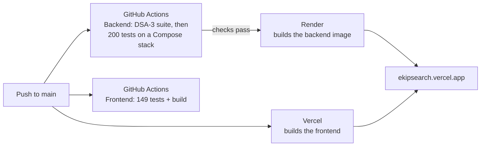

# Enterprise Knowledge Intelligence Platform: Project Overview

| | |
|---|---|
| **What it is** | A web platform that stores an organisation's documents, finds them by keyword, typo-tolerant keyword or meaning, and shows each person only what they may read |
| **Live** | https://ekipsearch.vercel.app (frontend on Vercel; API on Render; data on Neon, MongoDB Atlas and Qdrant Cloud, all on free plans) |
| **Repository** | https://github.com/SathyaMaragani/Enterprise-Knowledge-Intelligence-Platform |
| **Institution** | Department of Artificial Intelligence and Data Science, KL University (Koneru Lakshmaiah Education Foundation), Aziz Nagar, Hyderabad; odd semester 2026–27 |
| **Team** | M. Sathya Krishna (2510080006), Yashwanth (2510080001), Aneeq (2510080005), Abhinav (2510080002) |
| **Guide** | Anitha. P |

This is one integrated project built across four courses. Each course owns a part of the system, and the parts meet in one running product.

| Subject | Course | Owns | Detailed document |
|---|---|---|---|
| **DBE-DSD** | Database Systems Engineering and Distributed Backend Development (25CS1302E) | PostgreSQL, MongoDB and Qdrant; the Spring Boot API; security; the React frontend; containers and deployment | [docs/database/DBE-DSD.md](database/DBE-DSD.md) |
| **DSA-3** | Data Structures and Algorithms – 3 (25CS2103E) | TextHack, the from-scratch algorithm engine that scores keyword search and powers the workbench | [docs/algorithms/DSA-3.md](algorithms/DSA-3.md) |
| **ML** | Machine Learning (25SC2107E) | Choosing and validating the embedding model, the chunking rules, the demo corpus, document classification and clustering | [docs/ml/ML.md](ml/ML.md) |
| **OSSP** | Operating Systems and Systems Programming (25CS2104E) | ShellForge, a Unix shell in C (a separate component, not yet called by the platform) | [docs/ossp/OSSP.md](ossp/OSSP.md) |

---

## 1. The problem

Organisations keep their knowledge in documents: policies, procedures, runbooks, contracts, research notes. Three things go wrong:

1. **People can't find them.** Search by exact words fails when the reader doesn't know the wording. A question about "rules for working from home" misses a policy titled *Hybrid and Remote Working Standard*.
2. **Typing mistakes defeat search.** "remte workng standrd" finds nothing in a plain keyword search.
3. **Not everyone may see everything.** Salary bands, contracts and security procedures must reach only the right people. A search that shows a restricted *title*, or even a result *count* that includes it, is already a leak.

The platform answers all three:

- **By meaning:** semantic search over sentence embeddings.
- **By typo-tolerant keyword:** string algorithms with edit distance.
- **Safely:** one permission rule, applied to every result before it is ranked.

It stores each kind of data in the database built for it, and keeps those databases consistent.

---

## 2. What users can do

| Role | Can |
|---|---|
| **Employee** | Sign in; search in four modes; browse the repository; read their own documents and those shared with them; see their search history; use the TextHack workbench and the ML insights page |
| **Manager** | Everything above, plus upload documents (PDF, Word, text, Markdown up to 10 MB) and share their own documents with colleagues |
| **Administrator** | Everything, on every document; delete documents; create accounts, change roles, disable accounts, reset passwords |

**Pages:**

- **Sign-in**, with a "starting the server" screen while the free-tier backend wakes up.
- **Dashboard:** greeting, search-mode chips, drag-and-drop upload, live counts, recent documents, recent searches, document activity.
- **Search:** four modes, filters, paging, match signals and relevance.
- **Repository:** paged and filtered.
- **Document viewer:** extracted text, chunks, processing details, sharing, delete.
- **Upload.**
- **Administration.**
- **TextHack workbench:** pattern search, similarity and alignment, citation flow, complexity table.
- **ML insights:** classification and clustering results.

**Search modes:**

| Mode | Finds documents by |
|---|---|
| Hybrid (default) | Keyword and meaning together |
| Semantic | Meaning only |
| Keyword | Exact words, in any order |
| Fuzzy | Words with typing mistakes too |

---

## 3. How the four subjects fit together



- **DBE-DSD is the platform.** All storage, all APIs, all security and the whole user interface are DBE-DSD code.
- **DSA-3 runs inside it.** The backend compiles the TextHack engine directly, unchanged. One copy of each algorithm is tested by DSA-3's 452-assertion suite and runs every keyword search in production.
- **ML decided how meaning is represented.** It chose `all-MiniLM-L6-v2` on a public benchmark with significance testing, and proved the backend's Java version gives identical results. It also set the chunking rule, generated the demo data and produced the ML insights page.
- **OSSP built ShellForge** alongside the platform, following the course handbook from a REPL to signals, pipes and redirection. It runs on its own. The architecture sketch's "API → ShellForge" link is future work. OS-level engineering in the platform itself (memory tuning, thread limits, containers) is described in the OSSP document.

---

## 4. System architecture



| Tier | Technology | Responsibility |
|---|---|---|
| Presentation | React 19, React Router 7, Vite 8; served by Vercel (or nginx in Docker) | All pages; JWT kept in session storage; shows only actions the user's permissions allow |
| Application | Spring Boot 3.4.2, Java 21, Spring Security, Spring Data JPA and MongoDB, Qdrant gRPC client, ONNX Runtime, PDFBox, TextHack | Authentication and authorisation, document ingestion across three stores, unified search, administration, the workbench |
| Data | PostgreSQL 16, MongoDB 7, Qdrant 1.12 | Identity and metadata; document text and chunks; chunk embeddings |

The browser talks to one origin: Vercel forwards `/api/*` to Render, so no CORS configuration is needed. The model runs inside the backend process, so there is no separate model server.

---

## 5. Data architecture

### 5.1 One key, three databases

| Store | Owns | Linked by |
|---|---|---|
| PostgreSQL | Users, roles, permissions, categories, document metadata, versions, tags, per-user grants, search history (12 tables, 3NF) | `documents.id` |
| MongoDB | Extracted text, chunks, flexible metadata, source and processing details (`knowledge_documents`, validated by `$jsonSchema`) | `postgres_document_id` |
| Qdrant | One 384-d cosine vector per chunk, HNSW-indexed, with a payload (`knowledge_chunks`) | payload `postgres_document_id` |



Full schema, constraints and indexes: [DBE-DSD §3](database/DBE-DSD.md#3-polyglot-persistence-which-database-owns-what).

### 5.2 Three datasets, three jobs

| Dataset | Size | Used for |
|---|---|---|
| Seeded fixtures | 10 documents, 30 vectors | Deterministic backend integration tests |
| FiQA-2018 (BEIR) | 57,638 documents, 648 judged queries | ML evaluation that chose the embedding model |
| Demo corpus | 315 documents, 6 categories, 705 vectors, 14 users, 60 grants, 32 queries | The demo stack, screenshots and experiments; generated by the ML subject |

---

## 6. Key flows

### 6.1 Sign-in and every request



### 6.2 Upload



### 6.3 Search



### 6.4 Delete

`DELETE /api/documents/{id}` needs DOCUMENT_DELETE and read access, and removes data in this order:

1. **Qdrant points first.** If Qdrant is unreachable, nothing is removed and the request returns 503, so it can be retried.
2. **The MongoDB document.**
3. **The PostgreSQL row,** which cascades to versions, tags and grants.

---

## 7. Security model

- **Passwords.** BCrypt hashes (8–72 characters). A failed sign-in always says "Invalid username or password", including for disabled accounts, so the response never reveals whether an account exists.
- **Tokens.** HS256 JWTs valid for 24 hours, accepted only while the account is enabled. The signing secret has no default; Render generates it.
- **Authorisation by permission.**
  - Endpoints require permissions (DOCUMENT_CREATE/READ/UPDATE/DELETE, USER_MANAGE, ROLE_MANAGE), not role names.
  - ADMIN holds all six permissions, MANAGER holds create, read and update, and EMPLOYEE holds read.
- **One document-read rule.** Owner, READ grant or administrator, defined once in `DocumentAccessService`. It is applied to every endpoint that returns document data, and in search *before* ranking, so even counts never reveal hidden documents.
- **Upload safety.**
  - Files up to 10 MB, and up to 1 MB of extracted text.
  - XML DTDs and external entities are disabled.
  - Unzipping stops at 64 MB.
  - Text files must be strict UTF-8.
- **Errors.** Correct status codes (400, 401, 403, 404, 405, 409, 413, 415, 503) with JSON bodies. Exception text is never sent to clients.
- **Configuration.** No secrets in the repository: every credential comes from environment variables. Production health output hides component details.

Measured on the demo corpus:

- The administrator sees all 315 documents.
- Managers see 28–48 and employees 15–30.
- Only the administrator can open user administration; everyone else gets 403.

---

## 8. Technology stack

| Area | Technology |
|---|---|
| Backend | Java 21, Spring Boot 3.4.2 (Web, Security, Data JPA, Data MongoDB, Validation, Actuator), jjwt 0.11.5, Qdrant Java client 1.13.0 (gRPC), ONNX Runtime 1.17.1, DJL tokenizers 0.26.0, Apache PDFBox 3.0.8, Maven |
| Algorithms | TextHack: plain Java with no `java.util` inside the engine; built with `javac` alone |
| Frontend | React 19, React Router 7, Vite 8, Vitest 4 + Testing Library; plain CSS and inline SVG (no UI kit, chart or icon library) |
| Databases | PostgreSQL 16 (Neon in production), MongoDB 7 (Atlas), Qdrant 1.12 (Qdrant Cloud) |
| Machine learning | Python 3.10, scikit-learn, ONNX Runtime, tokenizers, sentence-transformers (evaluation), `all-MiniLM-L6-v2` |
| Systems programming | C (gcc 13), POSIX system calls, Make, Valgrind, GDB, AddressSanitizer |
| DevOps | Docker, Docker Compose, nginx, GitHub Actions, Vercel, Render (Blueprint in `render.yaml`) |

---

## 9. Repository layout

```
enterprise-knowledge-intelligence/
├── README.md, PROJECT_STATUS.md, TASK_STATUS.md   project status records
├── render.yaml                                    Render Blueprint (backend deploy)
├── docs/
│   ├── PROJECT_OVERVIEW.md                        this document
│   ├── database/DBE-DSD.md                        subject documents
│   ├── algorithms/DSA-3.md
│   ├── ml/ML.md
│   ├── ossp/OSSP.md
│   ├── presentations/<subject>/                   review decks and the DB final report
│   └── architecture/                              architecture and ONNX notes
├── models/minilm/                                 ONNX model + tokenizer (fetched by script)
└── subjects/
    ├── DBE-DSD/
    │   ├── database/   postgresql/, mongodb/, qdrant/, demo/, docker-compose.test.yml, docker-compose.demo.yml
    │   ├── backend/    Spring Boot application, Dockerfile, docs/ (API, TESTING, ARCHITECTURE)
    │   ├── frontend/   React application, Dockerfile, nginx template, vercel.mjs
    │   ├── docker/     full-stack Compose, smoke and load tests
    │   └── deploy/     free-tier deployment guides
    ├── DSA-3/          texthack/ engine, tests/, benchmarks/, examples/, docs/COMPLEXITY.md
    ├── ML/             src/ (preprocessing, embeddings, evaluation, demo, features, classification, clustering), tests/, docs/, results/
    └── OSSP/shellforge/  src/, include/, tests/, docs/WEEK1..9.md, Makefile
```

---

## 10. Running the project

| Goal | Steps |
|---|---|
| **Whole stack in Docker** | `cd subjects/DBE-DSD/docker && cp .env.example .env`, fill in every value (`JWT_SECRET`, database passwords, bootstrap administrator), then `docker compose up -d --build --wait` and open http://localhost:8088. See [docker/README.md](../subjects/DBE-DSD/docker/README.md). |
| **Backend tests** | Start the test stack (`docker compose -f subjects/DBE-DSD/database/docker-compose.test.yml up -d --wait`), fetch the model (`backend/model/fetch-model.sh`), then run `./mvnw test` with the environment in [TESTING.md](../subjects/DBE-DSD/backend/docs/TESTING.md). |
| **Frontend (development)** | `cd subjects/DBE-DSD/frontend && npm install && npm run dev`. Vite proxies `/api` to `API_TARGET` (default `http://localhost:8080`). `npm test` runs the suite. |
| **DSA-3 engine** | `cd subjects/DSA-3 && sh run-tests.sh`; `java -cp out examples.Demos`; `java -cp out benchmarks.Benchmark` |
| **ML** | `cd subjects/ML && pip install -r requirements.txt`, then the commands in [ML §8](ml/ML.md#8-tests) |
| **ShellForge** | `cd subjects/OSSP/shellforge && docker run --rm -v "$(pwd):/src" -w /src gcc:13 sh -c "make clean && make test"` |

---

## 11. Testing and quality

| Subject | What is tested | Result |
|---|---|---|
| DBE-DSD backend | Unit tests with stubs, plus integration tests on live PostgreSQL, MongoDB and Qdrant (security, upload rollback, text extraction, search fusion, permissions, errors) | **204 pass**: 200 in GitHub Actions on every backend change, plus 4 demo-corpus tests run locally |
| DBE-DSD frontend | 16 Vitest files: pages, session, API client | **149 pass** in GitHub Actions |
| Full stack | Smoke test through nginx; load test with 50 users for 30 s | **28 / 28 checks**; **169 requests/s, 0 errors** |
| DSA-3 | Six self-checking suites, including 4,000 randomised cross-validation cases | **452 assertions**, 0 failures, 0 compiler warnings; also run by the Backend workflow in GitHub Actions |
| ML | Pipeline, embeddings, classification/clustering consistency, Java/Python parity, retrieval equivalence | 15 + 6 + 4 checks pass; Java and Python top-5 results 100% identical |
| OSSP | Six weekly suites plus a zombie-reaping check; Valgrind, GDB and sanitizers | **148 checks** pass |

Each subject's document lists the defects its tests found and how they were fixed. Examples:

- three endpoints that skipped the permission rule;
- a race between the shell's SIGCHLD handler and its foreground wait;
- a lock contended under load.

Several tests were confirmed to catch real faults by breaking the code on purpose and watching them fail.

---

## 12. Deployment



- **Free plans only.**
  - Vercel (frontend);
  - Render Free (backend: 512 MB, 0.1 CPU, Singapore; deploys only commits whose checks pass);
  - Neon (PostgreSQL), MongoDB Atlas and Qdrant Cloud.
- **Fitting into 512 MB:**
  - a 128 MB Java heap;
  - one ONNX inference thread;
  - limited malloc arenas;
  - a class-data-sharing archive built at image build time;
  - at most 16 request threads and 4 database connections.
- **Result at Render's limits:**
  - healthy after about 100 s;
  - semantic search 0.4–0.9 s (6.5–9.4 s before tuning);
  - hybrid search 0.5–0.6 s;
  - memory 446 MiB steady, 485 MiB peak.
- **Cold starts.** The free backend sleeps after 15 minutes without traffic, so the backend requests its own public `/api/health` every 10 minutes to keep itself running. After a deploy or a restart, the frontend shows a "starting the server" screen until the backend answers.

---

## 13. Timeline

| Date (2026) | Milestone |
|---|---|
| 11 Aug | Repository structure; PostgreSQL schema; MongoDB document model; Qdrant foundation; Spring Boot backend with MongoDB integration |
| 17 Aug | ShellForge Week 2 |
| 10–11 Sep | Qdrant integration; JWT authentication and document-level RBAC; unified search across three databases; ShellForge Week 3; ML dataset, preprocessing and baseline (1.7B-1) |
| 12 Sep | ML embedding evaluation (1.7B-2); in-process Java ONNX embeddings with verified parity; semantic search |
| 16 Sep | TextHack complete (string, DP, flow, approximation, randomised, engine); keyword search scored by TextHack; React frontend with JWT; permission-leak fix; ShellForge Week 5 |
| 17 Sep | API error handling; repository and document viewer; search page; upload and delete across three stores; user administration and grants; containerised full stack with smoke and load tests; TextHack workbench; search modes and activity |
| 18 Sep | Render free-tier deployment prepared and tuned |
| 5 Oct | Live deployment recorded; document classification and clustering with the ML insights page; ShellForge Weeks 6–9; light green redesign |
| 6 Oct | PDF and Word (.docx) upload support |

---

## 14. Results at a glance

| Result | Value |
|---|---|
| Semantic search | "working from home rules" ranks the *Hybrid and Remote Working Standard* first; keyword search alone finds nothing |
| Fuzzy search | "remte workng standrd" (three typos) recovers the remote-working standard (score 0.63) |
| Embedding model choice | MiniLM vs TF-IDF: nDCG@10 0.624 vs 0.371 (p < 0.0001); MiniLM vs BGE not significantly different, and MiniLM embeds 2.5× faster |
| Uploads | A 20-page Word-made PDF: 5,005 words, 36 chunks, searchable in 2.1 s; the same as .docx in 1.2 s; every malformed file gets a specific error |
| Classification | 0.83 accuracy on 6 locked unseen topics; 0.57 with every topic held out (chance 0.19; a leaky random split would claim 1.00) |
| Clustering | DBSCAN finds all 21 topics without being told how many; k-means++ beats random starts at k = 24 (topic ARI 0.98 vs 0.79) |
| Algorithms | Aho-Corasick 15.5× faster than repeated KMP for 80 patterns |
| Systems | ShellForge runs a full session with 58 allocations and 58 frees, 0 Valgrind errors |

---

## 15. Limitations and roadmap

- **Body matching is exact and unindexed.** Typo tolerance covers titles and descriptions only, and each keyword search scans every body in MongoDB; the `content.raw_text` text index or Atlas Search would take over as the corpus grows.
- **Vector hits are filtered after Qdrant's top-K,** so restricted users can get fewer than K semantic hits. Passing readable ids as a Qdrant payload filter would fix this.
- **No OCR** for scanned PDFs; Word headers, footers and footnotes are not extracted.
- **Embedding runs inside the upload request;** large files would be better served by a background job.
- **The backend is a single service.** Splitting search and ingestion behind an API gateway, and adding Prometheus/Grafana monitoring, are the next steps for the DBE course's microservice and observability outcomes.
- **ML results are displayed, not yet served.** Suggesting a category on upload is the natural next step.
- **ShellForge is standalone.** Job control, FIFOs, shared memory, `mmap` demonstrations and threads remain from the OSSP syllabus.

---

## 16. Documentation index

| Topic | Document |
|---|---|
| DBE-DSD subject | [docs/database/DBE-DSD.md](database/DBE-DSD.md) |
| DSA-3 subject | [docs/algorithms/DSA-3.md](algorithms/DSA-3.md) |
| ML subject | [docs/ml/ML.md](ml/ML.md) |
| OSSP subject | [docs/ossp/OSSP.md](ossp/OSSP.md) |
| REST API reference | [subjects/DBE-DSD/backend/docs/API.md](../subjects/DBE-DSD/backend/docs/API.md) |
| Backend tests | [subjects/DBE-DSD/backend/docs/TESTING.md](../subjects/DBE-DSD/backend/docs/TESTING.md) |
| PostgreSQL ERD and data dictionary | [ERD.md](../subjects/DBE-DSD/database/postgresql/docs/ERD.md), [DATA_DICTIONARY.md](../subjects/DBE-DSD/database/postgresql/docs/DATA_DICTIONARY.md) |
| MongoDB and Qdrant models | [DOCUMENT_MODEL.md](../subjects/DBE-DSD/database/mongodb/docs/DOCUMENT_MODEL.md), [VECTOR_MODEL.md](../subjects/DBE-DSD/database/qdrant/docs/VECTOR_MODEL.md) |
| Frontend design and pages | [subjects/DBE-DSD/frontend/README.md](../subjects/DBE-DSD/frontend/README.md) |
| Containers and deployment | [docker/README.md](../subjects/DBE-DSD/docker/README.md), [deploy/README.md](../subjects/DBE-DSD/deploy/README.md) |
| TextHack complexity | [subjects/DSA-3/docs/COMPLEXITY.md](../subjects/DSA-3/docs/COMPLEXITY.md) |
| ML decisions and evaluations | [DATASET_AND_MODEL_SELECTION.md](../subjects/ML/docs/DATASET_AND_MODEL_SELECTION.md), [PHASE_1_7B_2_EVALUATION.md](../subjects/ML/docs/PHASE_1_7B_2_EVALUATION.md), [DOCUMENT_CLASSIFICATION_AND_CLUSTERING.md](../subjects/ML/docs/DOCUMENT_CLASSIFICATION_AND_CLUSTERING.md) |
| ShellForge weeks | [subjects/OSSP/shellforge/docs/](../subjects/OSSP/shellforge/docs/) |
| Embedding architecture | [docs/architecture/ONNX_EMBEDDING.md](architecture/ONNX_EMBEDDING.md) |
| Status records | [PROJECT_STATUS.md](../PROJECT_STATUS.md), [TASK_STATUS.md](../TASK_STATUS.md) |

### Review presentations and reports

The decks are kept as they were presented, so earlier ones describe plans that later changed. For example, DBE-DSD Review 2 lists Node.js/FastAPI and Pinecone as candidates, and OSSP Review 2 covers Weeks 1–6 only. The sections above describe what was actually built.

| Subject | Review | File | Prepared (2026) |
|---|---|---|---|
| DBE-DSD | Review 1: problem, objectives, hybrid architecture | [DBE-DSD-Review-1.pptx](presentations/DBE-DSD/DBE-DSD-Review-1.pptx) | 1 Aug |
| DBE-DSD | Review 2: literature review, gap analysis, proposed system | [DBE-DSD-Review-2.pptx](presentations/DBE-DSD/DBE-DSD-Review-2.pptx) | 18 Aug |
| DBE-DSD | Final review report (PBL documentation) | [PDF](presentations/DBE-DSD/DBE-DSD-Final-Review-Report.pdf), [Word](presentations/DBE-DSD/DBE-DSD-Final-Review-Report.docx) | 6 Oct |
| DSA-3 | Review 1: TextHack plan, modules, timeline | [DSA-3-Review-1.pptx](presentations/DSA-3/DSA-3-Review-1.pptx) | 5 Aug |
| DSA-3 | Review 2: TextHack implementation, results, testing | [DSA-3-Review-2-TextHack.pptx](presentations/DSA-3/DSA-3-Review-2-TextHack.pptx) | 29 Sep |
| ML | Project review: literature, gaps, method, evaluation plan | [ML-Review.pptx](presentations/ML/ML-Review.pptx) | 28 Aug |
| OSSP | Review 1: ShellForge plan, modules, timeline | [OSSP-Review-1-ShellForge.pptx](presentations/OSSP/OSSP-Review-1-ShellForge.pptx) | 7 Aug |
| OSSP | Review 2: ShellForge Weeks 1–6 | [OSSP-Review-2-ShellForge-Weeks1-6.pptx](presentations/OSSP/OSSP-Review-2-ShellForge-Weeks1-6.pptx) | 24 Sep |
