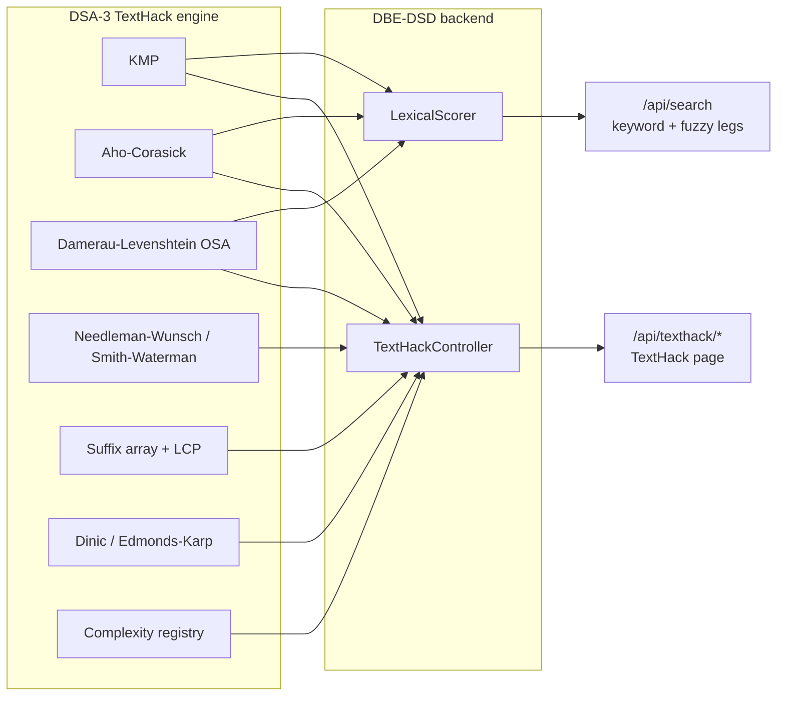

# DSA-3 in the Enterprise Knowledge Intelligence Platform

| | |
|---|---|
| **Course** | Data Structures and Algorithms – 3 (25CS2103E) |
| **Folder** | [`subjects/DSA-3/`](../../subjects/DSA-3/) |
| **Owns** | **TextHack**, an advanced-algorithm text engine written from scratch in Java |
| **Used by the platform for** | Keyword and fuzzy search scoring, and the TextHack workbench page |
| **Status** | All 20 syllabus algorithms implemented; 452 test assertions pass, with zero compiler warnings |

The DSA-3 syllabus is built around TextHack as a system. It is a text-analytics engine whose query classes each need a different advanced-algorithm family:

| Query class | Algorithm family |
|---|---|
| Pattern search | String matching |
| Fuzzy matching | Dynamic programming (edit distance) |
| Document similarity | Alignment and suffix structures |
| Citation-flow analysis | Maximum flow |
| Scheduling | Approximation for NP-hard problems |
| Primality testing | Randomised algorithms |

The project builds that engine, and the platform then uses it for real: every keyword search a user runs is scored by TextHack.

**The engine rule:** `java.util.*` is forbidden inside the engine, and every algorithm is hand-built. TextHack has its own primitives (`IntList`, `CharMap`, a seeded PRNG) instead of collections, and no Spring or library dependency. That is what lets the backend compile it in directly.

---

## 1. What is implemented

| Package | Algorithms | Files |
|---|---|---|
| `texthack/core` | Shared primitives: growable `IntList`, sorted `CharMap` for trie children, seeded `Prng` (SplitMix64), the `StringMatcher` contract | `IntList`, `CharMap`, `Prng`, `StringMatcher` |
| `texthack/string` | Naive, Knuth-Morris-Pratt, Z-algorithm, Rabin-Karp, Aho-Corasick, suffix array (prefix doubling), LCP array (Kasai) | `NaiveSearch`, `KmpSearch`, `ZSearch`, `RabinKarpSearch`, `AhoCorasick`, `SuffixArray`, `LcpArray` |
| `texthack/dp` | Levenshtein, Damerau-Levenshtein (unrestricted, and the restricted optimal-string-alignment variant), Needleman-Wunsch (global), Smith-Waterman (local) | `Levenshtein`, `DamerauLevenshtein`, `NeedlemanWunsch`, `SmithWaterman`, `Alignment` |
| `texthack/graph` | Ford-Fulkerson (DFS), Edmonds-Karp (BFS), Dinic, bipartite matching (Kuhn) | `FlowNetwork`, `FordFulkerson`, `EdmondsKarp`, `Dinic`, `BipartiteMatching` |
| `texthack/approximation` | 2-approximate vertex cover; list and LPT makespan scheduling | `VertexCover`, `MakespanScheduling` |
| `texthack/randomized` | Miller-Rabin (deterministic 64-bit and random witnesses), universal hashing (integers and strings), reservoir sampling (Algorithm R) | `MillerRabin`, `UniversalHashing`, `ReservoirSampling` |
| `texthack/engine` | `TextHack` facade, query language and parser, citation-flow analysis, complexity registry (22 algorithms) | `TextHack`, `Query`, `QueryParser`, `CitationFlow`, `ComplexityRegistry` |

The engine's own query language:

```
find "needle"                  exact search
findall "he" "she" "hers"      all patterns in one pass
fuzzy "recieve" ~2             within 2 edits
similar "colour" "color"       normalised similarity
prime 7919                     primality
```

---

## 2. How the platform uses TextHack

TextHack has no Spring dependency, so it is used as-is rather than rewritten. The backend's `pom.xml` adds `subjects/DSA-3/texthack` as a second source root through `build-helper-maven-plugin`. There is exactly one copy of each algorithm: verified by DSA-3's own test suite, and run by Spring in production.



### 2.1 Search scoring (`LexicalScorer`, phase 1.7C)

The keyword leg of `POST /api/search` has two passes, which report together as the `KEYWORD` source:

1. **Phrase pass.** PostgreSQL finds documents whose title or description contains the whole query.
2. **TextHack scan.** A scan over the documents that pass the category and status filters finds what a phrase match cannot: query terms in a different order, or misspelled.

Each candidate gets a `keywordScore` from 0 to 1:

| Evidence | Algorithm | Score |
|---|---|---|
| Whole query in the title | KMP | 1.0 |
| Whole query in the description | KMP | 0.75 |
| Term coverage, whole tokens only | Aho-Corasick (all terms in one pass) | up to 0.9 |
| A term within one or two edits | Damerau-Levenshtein, optimal string alignment | credit 0.7 (one edit) or 0.5 (two edits) instead of 1.0 |

- **Coverage.** Coverage averages a credit per query term. Terms found only in the description count at 0.6 of their credit.
- **Final score.** The result is the larger of the phrase score and the coverage, but a title phrase match always scores 1.0.
- **Edit allowance.** Allowed edits scale with term length, like Elasticsearch's AUTO fuzziness: none up to 3 characters, 1 edit for 4–7, 2 for 8 or more.
- **Ignored terms.** Stopwords and single characters are ignored.
- **Scan-only hits.** Documents found only by the scan must score at least 0.5.

**Why these algorithms.**

- **KMP** finds the phrase in linear time with no pathological input.
- **Aho-Corasick** checks every query term in one pass. That is the entire point of the automaton: running KMP once per term costs k times as much.
- **The optimal-string-alignment variant** counts a transposition such as `recieve` → `receive` as one edit. Plain Levenshtein charges two, and transposed letters are among the most common typos.

**Effect in the product.**

| Query | Mode | Result |
|---|---|---|
| `Finacial` | Fuzzy | Finds *Q1 Financial Report* (keyword mode finds nothing) |
| `remte workng standrd` (three misspellings) | Fuzzy | 15 hits on the 315-document demo corpus, led by versions of the *Hybrid and Remote Working Standard*, scored 0.63 and matched by Keyword + Fuzzy |

Hits that needed typo tolerance carry `FUZZY` in `matchedBy`.

**Why the keyword leg was upgraded instead of adding a new source.** A separate `FUZZY` source would have changed the `sources` list on every search and broken the API contract (`["KEYWORD"]` / `["KEYWORD","VECTOR"]`). Fuzzy matching is still lexical search, so it belongs in the lexical signal, with per-hit provenance saying when it was needed.

### 2.2 The TextHack workbench (`/texthack`)

| Endpoint | Panel | Algorithms |
|---|---|---|
| `POST /api/texthack/pattern` | Pattern search | KMP for one pattern, Aho-Corasick for several; the longest repeated substring from the suffix and LCP arrays; matches highlighted, with overlapping matches merged |
| `POST /api/texthack/similarity` | Similarity | Levenshtein and Damerau distances, similarity score, global (Needleman-Wunsch) and local (Smith-Waterman) alignments with score and identity |
| `POST /api/texthack/citations` | Citation flow | Influence as maximum flow (Dinic) and the bottleneck citations as the minimum cut (Edmonds-Karp); citations typed one `from to` per line |
| `GET /api/texthack/complexity` | Complexity | The engine's registry of 22 algorithms with time, space and notes |

- **Bounded work per request.** Alignment inputs are capped at 1,000 characters, because alignment is O(n·m).
- **Errors.** The engine's rejections become 400 responses carrying its message.
- **Access.** Every endpoint requires sign-in.
- **Thin controller.** The controller only maps requests and responses; every result is computed by the engine.

---

## 3. Complexity reference

| Algorithm | Time | Space | Note |
|---|---|---|---|
| Naive search | O(n·m) | O(1) | Reference implementation |
| KMP | O(n + m) | O(m) | No pathological input |
| Z-algorithm | O(n + m) | O(m) | No sentinel, no concatenation |
| Rabin-Karp | O(n + m) expected, O(n·m) worst | O(1) | Every hash hit verified |
| Aho-Corasick | O(n + z) after O(m) build | O(m) | Multi-pattern; z = matches; output links keep reporting proportional to z |
| Suffix array | O(n log n) | O(n) | Prefix doubling with counting sort, no comparison sort |
| LCP (Kasai) | O(n) | O(n) | Requires the suffix array |
| Levenshtein | O(n·m) | O(min(n, m)) | Rolling rows |
| Damerau-Levenshtein (unrestricted / OSA) | O(n·m) | O(n·m) | Different answers; the platform uses OSA |
| Needleman-Wunsch | O(n·m) | O(n·m) | Matrix kept for traceback |
| Smith-Waterman | O(n·m) | O(n·m) | Scores floored at zero |
| Ford-Fulkerson | O(E · maxflow) | O(V) | Bound depends on capacities |
| Edmonds-Karp | O(V·E²) | O(V) | Bound depends only on the graph |
| Dinic | O(V²·E) | O(V) | O(E·√E) on unit capacities |
| Bipartite matching (Kuhn) | O(V·E) | O(V) | Equivalent to unit-capacity max flow |
| Vertex cover | O(V + E) | O(V) | Ratio 2 |
| List scheduling | O(n·m) | O(n + m) | Ratio 2 − 1/m |
| LPT scheduling | O(n log n + n·m) | O(n + m) | Ratio 4/3 − 1/(3m) |
| Miller-Rabin | O(k · log³ n) | O(1) | Exact for all 64-bit n with deterministic witnesses; error < 4^−k with random ones |
| Universal hashing | O(1) integers, O(L) strings | O(1) | Collision probability ≤ 1/m |
| Reservoir sampling | O(n) | O(k) | One pass, unknown stream length |

Derivations and design notes: [`docs/COMPLEXITY.md`](../../subjects/DSA-3/docs/COMPLEXITY.md).

---

## 4. Testing

The only prerequisite is a JDK: no Maven, no JUnit, nothing to download.

```bash
cd subjects/DSA-3
sh run-tests.sh                    # compiles with -Xlint:all and runs every suite
java -cp out examples.Demos        # worked demonstrations of every module
java -cp out benchmarks.Benchmark  # timing, growth ratios, complexity table
```

| Suite | Assertions |
|---|---|
| `StringAlgorithmTests` | 96 |
| `SuffixAndMultiPatternTests` | 75 |
| `DpTests` | 61 |
| `GraphTests` | 45 |
| `ApproximationAndRandomizedTests` | 86 |
| `EngineTests` | 89 |
| **Total** | **452 passed, 0 failed, 0 `-Xlint:all` warnings** |

The same `run-tests.sh` runs in the Backend GitHub Actions workflow before the backend tests, so a change that breaks an algorithm also blocks a deploy.

**How the tests guard correctness.**

- **Randomised cross-validation.** 4,000 generated cases over a 2–4 letter alphabet are run through every single-pattern matcher, and each must agree with the naive reference. A small alphabet makes overlaps and accidental matches common, which is exactly where off-by-one errors surface.
- **Reproducible randomness.** Random inputs come from a hand-rolled generator, so any failing case can be replayed from its seed.
- **Edge cases:**
  - overlapping matches;
  - a 2,000-character pathological repeat (naive search's worst case);
  - the KMP failure function and Z-array tested in isolation;
  - non-ASCII and CJK text;
  - text containing `\u0000`, which breaks any implementation that relies on a NUL sentinel.
- **Nested patterns.** The `{he, she, his, hers}` over `"ushers"` case catches broken Aho-Corasick output links: `he` is found only through the output-link chain.
- **In the platform.**
  - `LexicalScorerTest` (17 tests) and the search integration tests check the scorer.
  - The workbench has its own backend and frontend tests.
  - Two deliberate code breakages were each caught: keeping the wrong citations in the cut, and failing to merge touching highlights.

### Benchmarks (best of 5 runs, after warm-up)

| Experiment | Result |
|---|---|
| Exact search, pattern `a^40 b` in `a^n`, n = 160,000 | Naive 13.7 ms; KMP 1.05 ms; Z 1.03 ms; Rabin-Karp 2.8 ms |
| Aho-Corasick vs KMP run once per pattern | 5 patterns: 1.3× faster; 20: 4.6×; 80: **15.5×**. Aho-Corasick's time stays nearly flat as patterns are added. |
| Suffix array construction | Time roughly doubles as n doubles (1.93×, 2.27×), as O(n log n) predicts |
| Levenshtein | About 4–6× per doubling of both strings, as O(n·m) predicts |

---

## 5. How the course syllabus maps to the project

| Syllabus module | Where it appears |
|---|---|
| TextHack as a system; the query classes; the `java.util` ban | The engine, its query language, and the facade the backend calls |
| String algorithms: naive, KMP, Z, Rabin-Karp, Aho-Corasick, suffix arrays, LCP | `texthack/string`; KMP and Aho-Corasick score live search; the workbench's pattern panel |
| Dynamic programming: edit distance and alignment | `texthack/dp`; Damerau-Levenshtein (OSA) gives search its typo tolerance; the workbench's similarity panel |
| Network flow: max-flow, min-cut, matching | `texthack/graph`; the workbench's citation-flow panel (Dinic influence, Edmonds-Karp minimum cut) |
| Approximation for NP-hard problems | `texthack/approximation`: vertex cover, list and LPT scheduling |
| Randomised algorithms | `texthack/randomized`: Miller-Rabin, universal hashing, reservoir sampling |
| Complexity analysis | `docs/COMPLEXITY.md`, the in-engine registry shown in the workbench, and the benchmark harness that checks growth rates |

---

## 6. Limitations

- **No Wikipedia corpus.** The syllabus's Indian-language Wikipedia corpus was deliberately not imported. It is a data-acquisition and licensing task (dump selection, licence review, storage), not an algorithm. In the platform, TextHack runs over the documents users upload instead.
- **Typo tolerance stops at the description.** The scorer also credits exact words in the document body, found by MongoDB; Damerau-Levenshtein runs only on titles and descriptions.
- **Stale layout section.** The folder's own [README](../../subjects/DSA-3/README.md) still labels some packages "not yet implemented" in its layout section. Its status table is the current one: all packages are implemented.
