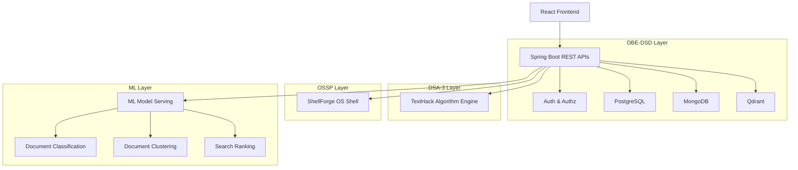

# Project Architecture

```mermaid
graph TD
    Client[React Frontend] --> API[Spring Boot REST APIs]
    
    subgraph "DBE-DSD Layer"
    API --> Auth[Auth & Authz]
    API --> Postgre[PostgreSQL]
    API --> Mongo[MongoDB]
    API --> Qdrant[Qdrant]
    end
    
    subgraph "DSA-3 Layer"
    API --> TextHack[TextHack Algorithm Engine]
    end
    
    subgraph "OSSP Layer"
    API --> ShellForge[ShellForge OS Shell]
    end
    
    subgraph "ML Layer"
    API --> MLServing[ML Model Serving]
    MLServing --> Classification[Document Classification]
    MLServing --> Clustering[Document Clustering]
    MLServing --> Ranking[Search Ranking]
    end
```
