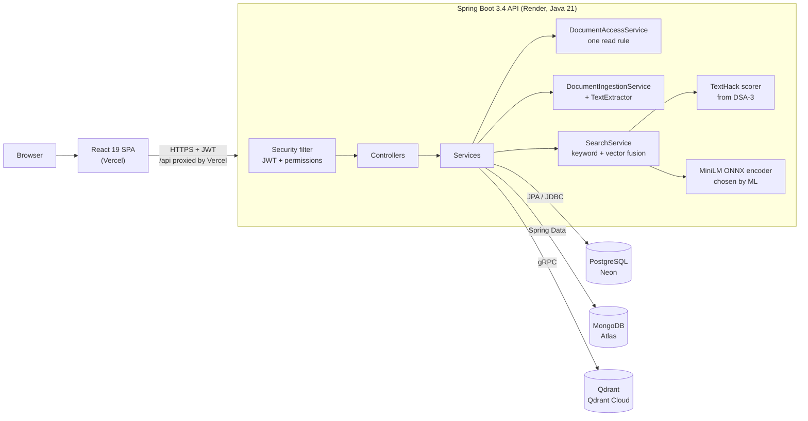
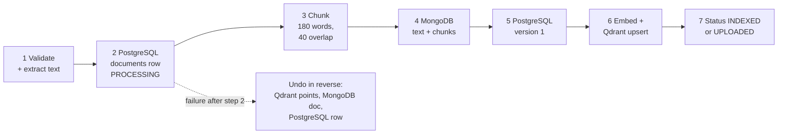
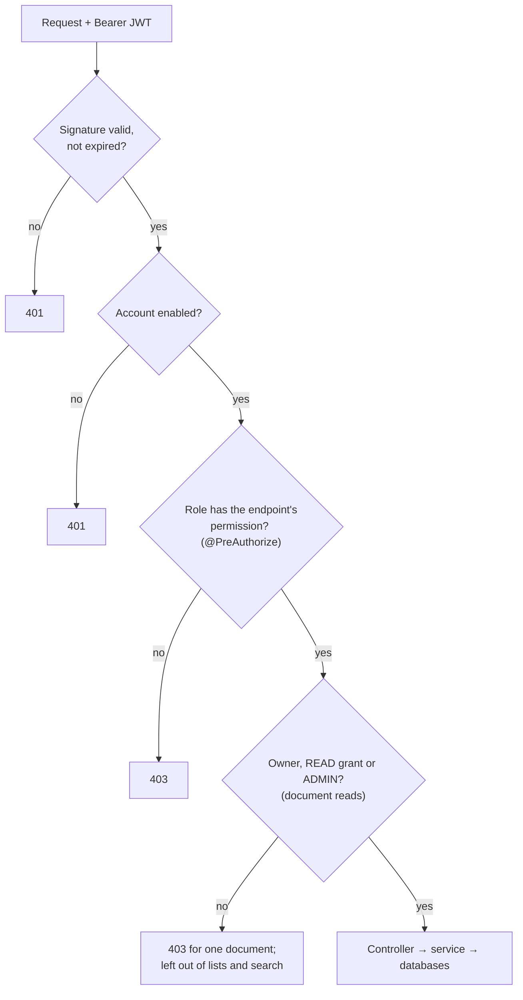
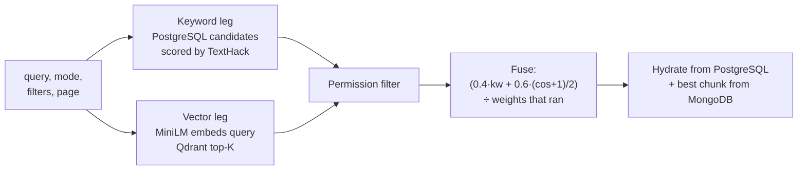

# DBE-DSD in the Enterprise Knowledge Intelligence Platform

| | |
|---|---|
| **Course** | Database Systems Engineering and Distributed Backend Development (25CS1302E), "DBE & DSD" |
| **Handbook project** | Project 1: *Enterprise Knowledge Intelligence Platform with Hybrid Relational, Document, and Vector Data Architecture* |
| **Folder** | [`subjects/DBE-DSD/`](../../subjects/DBE-DSD/) |
| **Owns** | The three databases, the Spring Boot REST API, authentication and authorisation, the React frontend, containers and deployment |
| **Status** | Live at https://ekipsearch.vercel.app (backend on Render) |

This is the subject the platform is built on. Everything a user touches (signing in, uploading, searching, reading, administering) runs through DBE-DSD code. The other three subjects plug into it:

- **DSA-3:** the TextHack engine scores keyword search and powers the workbench.
- **ML:** chose and validated the embedding model, generated the demo corpus, and produced the ML insights page.
- **OSSP:** ShellForge is a separate C project (see [OSSP](../ossp/OSSP.md)).

---

## 1. What the subject contributes

| Area | What was built | Where |
|---|---|---|
| Relational database | 12-table PostgreSQL schema in 3NF, constraints, indexes, migrations, seed and reference data | [`database/postgresql/`](../../subjects/DBE-DSD/database/postgresql/) |
| Document database | MongoDB `knowledge_documents` collection with a `$jsonSchema` validator, 9 indexes, seed, queries | [`database/mongodb/`](../../subjects/DBE-DSD/database/mongodb/) |
| Vector database | Qdrant `knowledge_chunks` collection: 384-d cosine vectors, HNSW, payload schema | [`database/qdrant/`](../../subjects/DBE-DSD/database/qdrant/) |
| Reproducible stacks | Pinned, self-seeding test stack and a 315-document demo stack, both in Docker Compose | [`database/docker-compose.test.yml`](../../subjects/DBE-DSD/database/docker-compose.test.yml), [`docker-compose.demo.yml`](../../subjects/DBE-DSD/database/docker-compose.demo.yml) |
| Backend | Spring Boot 3.4.2 on Java 21: 9 controllers, 16 services, JWT security, in-process embeddings | [`backend/`](../../subjects/DBE-DSD/backend/) |
| Frontend | React 19 single-page app: 9 pages, light green design system | [`frontend/`](../../subjects/DBE-DSD/frontend/) |
| Containers | Backend, frontend (nginx) and database images; full-stack Compose; smoke and load tests | [`docker/`](../../subjects/DBE-DSD/docker/) |
| Deployment | Vercel + Render Free + Neon + MongoDB Atlas + Qdrant Cloud, with tuning for 512 MB | [`deploy/`](../../subjects/DBE-DSD/deploy/), [`render.yaml`](../../render.yaml) |

---

## 2. Architecture

The browser only ever talks to one origin. Vercel serves the built frontend and forwards `/api/*` to the backend, so the backend needs no CORS configuration. The backend is the only component that talks to the databases.

---

## 3. Polyglot persistence: which database owns what

Each database owns one kind of data. The PostgreSQL `documents.id` is the key that links all three.

| Store | Owns | Why this store |
|---|---|---|
| **PostgreSQL** | Users, roles, permissions, categories, document metadata, versions, tags, per-user grants, search history | Structured data with relationships and rules that must be enforced: uniqueness, foreign keys, CHECK constraints, transactions |
| **MongoDB** | Each document's extracted text, its chunks, flexible metadata (authors, keywords, department), source and processing details | Long, variable text and metadata whose shape differs between documents; chunks are always read with their document |
| **Qdrant** | One 384-dimensional vector per chunk, with a payload (document id, chunk id, category, department, status) | Approximate nearest-neighbour search by meaning, which neither of the others can do |

For example, demo document 44 is:

- **In PostgreSQL:** row `id = 44`, with its category, owner, type and status.
- **In MongoDB:** a document with `postgres_document_id: 44`, holding 113 words of text and chunks `demo-44-0` and `demo-44-1`.
- **In Qdrant:** two points whose payload carries `postgres_document_id: 44`.

### 3.1 PostgreSQL schema (12 tables)

| Table | Purpose | Key constraints |
|---|---|---|
| `users` | Accounts and credentials | PK; UNIQUE `username`, `email`; BCrypt `password_hash`; `is_active` |
| `roles` | ADMIN, MANAGER, EMPLOYEE | UNIQUE `name` |
| `permissions` | DOCUMENT_CREATE/READ/UPDATE/DELETE, USER_MANAGE, ROLE_MANAGE | UNIQUE `name` |
| `user_roles` | users ↔ roles | Composite PK; FKs ON DELETE CASCADE |
| `role_permissions` | roles ↔ permissions | Composite PK; FKs ON DELETE CASCADE |
| `categories` | HR, Finance, Technical, Research, Legal, Administration | UNIQUE `name` |
| `documents` | Metadata and the reference to the content | FK category and owner, both ON DELETE SET NULL; CHECK `status` ∈ {UPLOADED, PROCESSING, INDEXED, FAILED, ARCHIVED} |
| `document_versions` | Version history | FK document (CASCADE), FK uploader (SET NULL); UNIQUE (document_id, version_number) |
| `tags`, `document_tags` | Free labels | UNIQUE tag name; composite PK |
| `document_permissions` | Per-user grants on a document | CHECK `permission_type` ∈ {READ, WRITE, DELETE}; UNIQUE (document, user, type) |
| `search_history` | Every user's searches | FK user (CASCADE); CHECK `search_type` ∈ {HYBRID, KEYWORD, FUZZY, SEMANTIC, TEXTHACK} |

**Normalisation (3NF).** Every non-key column depends on the key, the whole key and nothing else:

- A document stores `category_id`, not the category name.
- Roles reach permissions through `role_permissions` instead of repeating permission names per user.
- Versions, grants and tags live in their own tables keyed by document.

**Integrity in the database, not just the application.**

- UNIQUE constraints stop duplicate usernames, e-mail addresses and grants.
- CHECK constraints limit statuses, grant types and search modes to known values.
- Foreign-key actions decide what a deletion does. Deleting a document cascades to its versions, tags and grants. Deleting a user sets document ownership to NULL, so the documents survive.

**Indexes.** Ten secondary indexes cover the frequent lookups:

- users by e-mail and by username;
- documents by owner, category and status;
- versions and grants by document;
- grants by user;
- search history by user and by time.

**Migrations.** `V1__initial_schema.sql` creates the schema. `V2__search_history_hybrid.sql` widens the search-type CHECK when the hybrid and fuzzy modes were added.

Diagram: [`postgresql/docs/ERD.md`](../../subjects/DBE-DSD/database/postgresql/docs/ERD.md). Column-level detail: [`DATA_DICTIONARY.md`](../../subjects/DBE-DSD/database/postgresql/docs/DATA_DICTIONARY.md).

### 3.2 MongoDB document model

- **One document per PostgreSQL row** in `knowledge_documents`, linked by `postgres_document_id`.
- **Validator.** A `$jsonSchema` validator requires `postgres_document_id`, `title`, `content` (with `raw_text`), `source`, `processing` and `version`, and checks their types. It leaves `metadata` deliberately open for department, authors, keywords or custom fields.
- **Chunks are embedded** as an array inside their document, because they are always written and read together and never shared.
- **Nine indexes:** unique on `postgres_document_id`; title; `metadata.department`; `metadata.keywords`; `processing.status`; `version.number`; `created_at`; `updated_at`; and a text index over title and raw text.

Model and validation notes: [`DOCUMENT_MODEL.md`](../../subjects/DBE-DSD/database/mongodb/docs/DOCUMENT_MODEL.md), [`MONGODB_VALIDATION.md`](../../subjects/DBE-DSD/database/mongodb/docs/MONGODB_VALIDATION.md).

### 3.3 Qdrant vector store

- **Collection.** `knowledge_chunks`: 384 dimensions, cosine distance, HNSW index (m = 16, ef_construct = 100).
- **Vectors.** One point per chunk, produced by `all-MiniLM-L6-v2`. The ML subject chose this model and verified it gives identical results in Python and Java.
- **Payload.** Each point carries `postgres_document_id`, `chunk_id`, `title`, `category`, `department`, `chunk_position`, `page_number` and `processing_status`.
- **Start-up.** `QdrantCollectionInitializer` creates the collection and payload indexes if they are missing. A Qdrant outage is logged, not fatal.

Details: [`VECTOR_MODEL.md`](../../subjects/DBE-DSD/database/qdrant/docs/VECTOR_MODEL.md), [`PAYLOAD_SCHEMA.md`](../../subjects/DBE-DSD/database/qdrant/schemas/PAYLOAD_SCHEMA.md).

---

## 4. Keeping three databases consistent

There is no transaction across PostgreSQL, MongoDB and Qdrant. Writes are therefore ordered local steps, each of which can be undone: the **compensating-transaction (saga)** pattern.

### Upload (`POST /api/documents`)

1. **Validate and extract.** The caller needs DOCUMENT_CREATE. `.pdf`, `.docx`, `.txt` and `.md` files of up to 10 MB are accepted, and up to 1 MB of extracted text (section 5).
2. **PostgreSQL first.** The `documents` row is written with status PROCESSING, because it issues the id the other stores reference.
3. **Chunk.** The text is split into 180-word windows with a 40-word overlap. These are the same parameters as the ML pipeline, so demo chunks and uploaded chunks are cut identically.
4. **MongoDB.** The text, chunks, source, metadata and processing record are saved, including which extractor produced the text.
5. **History.** A `document_versions` row is added, version 1.
6. **Embed.** When the embedding model is enabled, each chunk is embedded and upserted to Qdrant.
7. **Final status.** INDEXED when vectors were stored. UPLOADED when the model is off or Qdrant is unavailable: the document is stored and keyword-searchable, just not semantically.

If anything fails after step 2, the earlier writes are removed in reverse order before the error is returned, so a failed upload leaves nothing behind.

### Delete (`DELETE /api/documents/{id}`)

Delete needs DOCUMENT_DELETE and read access to the document. It removes data in this order:

1. **Qdrant points first.** If Qdrant is unreachable, the request fails with 503 before anything is removed and can simply be retried.
2. **The MongoDB document.**
3. **The PostgreSQL row.** Its deletion cascades to versions, tags and grants.

### Availability (CAP)

Search favours availability. If Qdrant or the model is down, hybrid search answers from keywords alone and the response says so (`sources: ["KEYWORD"]`, and the UI shows a notice). Uploads still succeed, with status UPLOADED.

---

## 5. Text extraction (PDF, Word, text, Markdown)

[`TextExtractor`](../../subjects/DBE-DSD/backend/src/main/java/com/eip/backend/service/TextExtractor.java) turns an upload into plain text before chunking.

| Format | How | Rejected with 400 when |
|---|---|---|
| PDF | Apache PDFBox 3.0.8, text read in reading order | Password-protected; damaged; no text layer (scanned PDFs need OCR, which is not supported) |
| DOCX | The JDK's own zip and StAX parsers read `word/document.xml`: text runs, tabs, line breaks, one line per paragraph. No extra dependency. | Not a valid .docx zip |
| TXT / MD | Strict UTF-8 decoding | Not UTF-8, or contains NUL bytes |

- **Safety.**
  - DTDs and external entities are disabled in the XML parser, so a crafted file cannot make the server fetch or expand anything (XXE).
  - Unzipping stops at 64 MB to defeat zip bombs.
  - Text is capped at 1 MB however large the file.
- **Normalisation.** The BOM is removed and line endings become `\n`.
- **Recorded.** MongoDB stores the MIME type and the extractor (`pdfbox-3.0`, `docx-xml-1.0` or `utf8-text-1.0`).
- **Limits.**
  - The file limit is 10 MB in the service, in Spring's multipart settings and in nginx (11 MB, to allow for the multipart envelope).
  - Larger files get 413 `Files can be at most 10 MB`.
- **Not extracted.** Word headers, footers and footnotes live in other parts of the zip and are not included.

Measured on 6 October 2026 with real files over HTTP:

- A 20-page Word-generated PDF became 5,005 words in 36 chunks in 2.1 s.
- The same report as a .docx became 4,913 words in 35 chunks in 1.2 s.
- Every malformed file got its specific message.

---

## 6. Backend (Spring Boot)

**Stack:**

- Spring Boot 3.4.2 and Java 21: Web, Data JPA, Data MongoDB, Security, Validation, Actuator.
- PostgreSQL driver; Qdrant Java client 1.13.0 over gRPC.
- jjwt 0.11.5 for JSON Web Tokens.
- ONNX Runtime 1.17.1 and DJL tokenizers 0.26.0 for embeddings.
- PDFBox 3.0.8 for PDF text.
- The DSA-3 `texthack` package, compiled as a second source root.

| Package | Contents |
|---|---|
| `controller` | `AuthController`, `DocumentController`, `DocumentGrantController`, `CategoryController`, `SearchController`, `VectorSearchController`, `AdminController`, `TextHackController`, `HealthController` |
| `service` | `DocumentAccessService` (the read rule), `DocumentIngestionService`, `TextExtractor`, `TextChunker`, `SearchService`, `LexicalScorer`, `EmbeddingService`, `QdrantService`, `UnifiedDocumentService`, `KnowledgeDocumentService`, `DocumentService`, `DocumentGrantService`, `SearchActivityService`, `UserAdminService`, `UserService`, `CategoryService` |
| `security` | `SecurityConfig`, `JwtService`, `JwtAuthenticationFilter`, `CustomUserDetailsService`, entry point and access-denied handlers |
| `ml` | `MiniLmOnnxEncoder`: tokenizer, ONNX inference, attention-mask mean pooling, L2 normalisation |
| `config` | `BootstrapAdmin` (first administrator from configuration), `QdrantCollectionInitializer`, `QdrantConfig`, `EmbeddingConfig` |
| `entity`, `repository`, `dto`, `exception` | JPA entities and the MongoDB document model, Spring Data repositories, response objects, `GlobalExceptionHandler` |

### 6.1 Security model

- **Passwords.** Stored as BCrypt hashes, 8–72 characters (BCrypt's 72-byte limit).
- **Tokens.**
  - HS256 JWTs signed with `JWT_SECRET`, which has no default and is generated by Render in production.
  - A token is valid for 24 hours, and only while its account is enabled: disabling a user cuts off their tokens at once.
- **Permissions, not role names.** Endpoints check permissions, so a role can gain or lose a capability without code changes.

| Role | Permissions |
|---|---|
| ADMIN | DOCUMENT_CREATE, DOCUMENT_READ, DOCUMENT_UPDATE, DOCUMENT_DELETE, USER_MANAGE, ROLE_MANAGE |
| MANAGER | DOCUMENT_CREATE, DOCUMENT_READ, DOCUMENT_UPDATE |
| EMPLOYEE | DOCUMENT_READ |

- **One document-read rule,** in `DocumentAccessService`: you may read a document if you own it, hold a READ grant on it, or are an administrator.
  - It applies everywhere document data is returned: the list, the paged repository, single documents, unified search and the raw vector endpoints.
  - In search it runs *before* ranking and paging, so even result counts never reveal hidden documents.
- **Lock-out protection.** An administrator cannot disable or demote their own account.
- **Errors.** Every error is JSON with the right status code, and exception text is never shown to clients:

  | Status | When |
  |---|---|
  | 400 | Invalid input, malformed JSON, bad path variable |
  | 401 | Missing, invalid, expired or disabled-account token; wrong password (same message for a disabled account, so its existence isn't revealed) |
  | 403 | Missing permission |
  | 404 | No such document, user or grant |
  | 405 | Wrong HTTP method |
  | 409 | Duplicate username, e-mail or grant |
  | 413 | Oversized upload |
  | 415 | Wrong content type |
  | 503 | Qdrant or the model unavailable |
  | 500 | Anything else: a generic message, with the full exception logged |

### 6.2 REST API

| Method and path | Purpose | Requires |
|---|---|---|
| `POST /api/auth/login` | Sign in; returns a JWT | Public |
| `GET /api/auth/me` | Current user, roles and permissions | Signed in |
| `GET /api/health`, `/actuator/health` | Service health (component details hidden in production) | Public |
| `GET /api/documents` | All readable documents | Signed in |
| `GET /api/documents/page` | Paged list; category, status and text filters; access resolved in SQL | Signed in |
| `GET /api/documents/{id}` | PostgreSQL metadata merged with MongoDB text, chunks and processing | Read access |
| `POST /api/documents` | Upload (multipart) across the three stores | DOCUMENT_CREATE |
| `DELETE /api/documents/{id}` | Delete from Qdrant, MongoDB and PostgreSQL | DOCUMENT_DELETE + read access |
| `GET/POST/DELETE /api/documents/{id}/permissions` | List, grant and revoke READ | Owner or USER_MANAGE |
| `GET /api/categories` | Categories, sorted | Signed in |
| `POST /api/search` | Unified search: hybrid, semantic, keyword or fuzzy | Signed in; filtered |
| `GET /api/search/history` | Caller's own recent searches | Signed in |
| `POST /api/search/vector`, `POST /api/search/vector/document/{id}`, `GET /api/search/vector/collection-info` | Raw vector search, per-document chunks, collection statistics | Signed in; filtered |
| `POST /api/documents/search/semantic` | Semantic search returning unified documents | Signed in; filtered |
| `GET/POST/PATCH /api/admin/users`, `PUT /api/admin/users/{id}/password`, `GET /api/admin/roles` | Account administration | USER_MANAGE |
| `POST /api/texthack/pattern`, `/similarity`, `/citations`, `GET /api/texthack/complexity` | DSA-3 workbench | Signed in |

Full reference: [`backend/docs/API.md`](../../subjects/DBE-DSD/backend/docs/API.md).

### 6.3 Search

**Modes:**

| Mode | What runs |
|---|---|
| `HYBRID` (default) | Typo-tolerant keyword search plus semantic search |
| `KEYWORD` | Exact whole terms |
| `FUZZY` | Keyword search that also credits terms one or two edits away |
| `SEMANTIC` | Vectors only; returns 503 if the model is unavailable |

**Keyword leg:**

- PostgreSQL finds documents whose title or description contains the whole query.
- A TextHack scan finds reordered and misspelled queries: KMP for the phrase, Aho-Corasick for all terms in one pass, Damerau-Levenshtein for typos.

**Fusion:**

- Cosine similarity runs from −1 to 1, so it is mapped to 0–1 before weighting.
- Dividing by the weights of the legs that actually ran keeps scores on the same 0–1 scale when one leg is down.
- Each hit reports `matchedBy` (KEYWORD, FUZZY, VECTOR).

**Every search** is recorded in `search_history` and shown on the user's dashboard.

---

## 7. Frontend (React)

**Stack:** React 19, React Router 7, Vite 8 and Vitest 4 with Testing Library. It uses plain CSS and inline SVG: no UI kit, icon library, chart library or state library. Fonts are Plus Jakarta Sans and Caveat.

| Page | What it does |
|---|---|
| Sign-in | Username and password; "starting the server" screen while the free-tier backend wakes up |
| Dashboard (`/`) | Greeting hero with search-mode chips and drag-and-drop upload; live counts (documents, indexed, categories, vector chunks); recent documents; your recent searches; document activity; feature shortcuts |
| Search (`/search`) | Four modes, category and status filters, paging; hits show match signals and relevance; everything lives in the URL |
| Repository (`/repository`) | Paged table of readable documents with filters |
| Document (`/documents/{id}`) | Metadata, extracted text, chunks, source and processing details, sharing panel, delete |
| Upload (`/upload`) | PDF, DOCX, TXT or MD up to 10 MB; client-side checks mirror the server's |
| Administration (`/admin`) | Accounts table, role changes, disable, password reset, add user |
| TextHack (`/texthack`) | DSA-3 workbench: pattern search, similarity and alignment, citation flow, complexity table |
| ML insights (`/insights`) | ML subject's classification and clustering results, in SVG charts |

- **Session.** The JWT is kept in `sessionStorage`. The client signs out when it expires, or on any 401 to a request that carried a token.
- **Permission-aware UI.** The UI offers only what the user's permissions allow. The backend enforces every rule again, so a hidden button is a convenience, not a control.

---

## 8. Containers and deployment

- **Images.**
  - The backend image builds with Maven and runs as a non-root user on a Temurin 21 JRE; glibc is needed for ONNX Runtime.
  - The frontend image serves the Vite build with nginx. It proxies `/api`, falls back to the app shell for client-side routes, and caches hashed assets forever.
- **Compose.** [`docker/docker-compose.yml`](../../subjects/DBE-DSD/docker/docker-compose.yml) runs postgres, mongodb, qdrant, backend and frontend:
  - only the web port is published;
  - secrets are required, with no defaults;
  - health checks cannot pass before the seed scripts finish.
- **Production (free tier only).**
  - The frontend is on Vercel.
  - The backend is on Render Free (512 MB, 0.1 CPU, Singapore). It deploys only commits whose GitHub checks pass.
  - The data is on Neon (PostgreSQL), MongoDB Atlas and Qdrant Cloud.
- **Fitting into 512 MB.** The unchanged image was killed for lack of memory at 512 MB. It now fits thanks to:
  - a 128 MB Java heap;
  - one ONNX intra-op thread with no CPU arena (ONNX Runtime had started a busy thread per host core);
  - `MALLOC_ARENA_MAX=2`;
  - a class-data-sharing archive built at image build time;
  - at most 16 request threads and 4 database connections.

Guides: [`deploy/README.md`](../../subjects/DBE-DSD/deploy/README.md), [`RENDER-FREE-COMPATIBILITY.md`](../../subjects/DBE-DSD/deploy/RENDER-FREE-COMPATIBILITY.md), [`docker/README.md`](../../subjects/DBE-DSD/docker/README.md).

---

## 9. Testing and results

| Suite | Result |
|---|---|
| Backend (JUnit 5, MockMvc, Spring Security test) | **191 tests pass**: 187 in GitHub Actions on every backend change, plus 4 demo-corpus tests run locally |
| Frontend (Vitest + Testing Library, 16 files) | **149 tests pass** |
| Smoke test through nginx (`docker/smoke-test.mjs`) | **28 / 28 checks**: sign-in, account creation per role, upload with embedding, access denial and grants, keyword and semantic search, the 413 limit, clean-up |
| Load test (`docker/load-test.mjs`) | 50 users for 30 s, backend capped at 1 GB: **169 requests/s, 0 errors** |
| Render free-tier limits | Healthy after 101 s; semantic search 0.4–0.9 s (was 6.5–9.4 s before tuning); hybrid 0.5–0.6 s; memory 446 MiB steady, 485 MiB peak |

Backend test classes:

| Class | Tests | Needs databases? |
|---|---|---|
| `EipApplicationTests` (integration) | 105 | Test stack |
| `SearchServiceTest` | 25 | No |
| `LexicalScorerTest` | 15 | No |
| `TextExtractorTest` | 9 | No |
| `TextChunkerTest` | 8 | No |
| `DocumentIngestionServiceTest` (rollback paths) | 6 | No |
| `SearchActivityServiceTest` | 6 | No |
| `MiniLmOnnxEncoderTest` | 6 | Model files |
| `BootstrapAdminTest` | 5 | No |
| `DemoSemanticSearchIntegrationTest` | 4 | Demo stack |
| `ProdProfileTest` | 2 | Test stack |

**Defects found by testing, and fixed:**

| Defect | Fix |
|---|---|
| Three read endpoints (`GET /api/documents` and two vector endpoints) skipped the permission rule | They now filter through `DocumentAccessService`; 7 tests were written first and seen failing |
| Fused scores could go negative because cosine was treated as 0–1 | Map cosine with `(cos + 1) / 2` |
| A status-filtered search returned vector hits of any status | Hits are filtered on their PostgreSQL status after merging |
| A disabled user's token kept working for up to 24 hours | Tokens are accepted only for enabled accounts |
| A security context could leak between requests | Each request gets a new context |
| Blank logins, malformed JSON and the like returned 500 with exception text | They now return the correct 4xx, and exception text is never shown |
| The load test showed request threads queuing on a lock | The JWT parser is now built once at start-up, not per request: 149 → 181 requests/s |

Running the tests: [`backend/docs/TESTING.md`](../../subjects/DBE-DSD/backend/docs/TESTING.md).

---

## 10. How the course outcomes map to the project

| Course outcome | Topic | Where in the project |
|---|---|---|
| CO1 Relational database engineering | ER modelling, 3NF, DDL and constraints, indexes, SQL querying, transactions | 12-table schema, ERD, data dictionary, CHECK/UNIQUE/FK actions, 10 indexes, migrations; joins and GROUP BY aggregates in `common_queries.sql` and `reporting_queries.sql`; `schema_tests.sql` proves each constraint by attempting a violation inside `BEGIN … ROLLBACK`; JPQL repositories that resolve access inside the query. Views, CTEs and window functions are not used. |
| CO2 Database engineering | SQL vs NoSQL, MongoDB modelling and indexing, polyglot persistence, consistency strategies, vector databases, hybrid search | Three stores with one join key; `$jsonSchema` validator and 9 indexes; compensating actions on upload and delete; Qdrant HNSW; hybrid keyword + vector search |
| CO3 Backend API engineering | REST design, authentication and security (JWT, hashing, RBAC), database integration and testing, layered architecture | REST API with consistent errors; JWT + BCrypt + permissions + per-document grants; 191 backend tests on live databases; controller–service–repository layering |
| CO4 Multi-framework backend | Spring Boot core, JPA, validation, Spring Security, Actuator | Spring Boot 3.4 service; Spring Security filter chain; Actuator health with details hidden in production |
| CO5 Microservices | Service boundaries, distributed consistency (sagas, compensating actions) | Compensating writes across three databases. The backend itself is one service, not split into microservices (see limitations). |
| CO6 Deployment and delivery | Docker, Compose, CI/CD, load testing, documentation | Dockerfiles, Compose with health checks, GitHub Actions for backend and frontend, deploy-on-green to Render, smoke and load tests, this documentation |

The handbook's week-wise schedule also lists FastAPI and Node.js/Express. The handbook allows Spring Boot as the backend, and the whole API is Spring Boot; FastAPI and Node.js are not used.

---

## 11. Limitations and future work

- Keyword and fuzzy matching cover titles and descriptions only. The body is reached by semantic search; the MongoDB text index could extend keyword search to it.
- Vector hits are filtered after Qdrant applies top-K, so a restricted user can get fewer than K semantic hits. Passing the readable ids to Qdrant as a payload filter would fix this.
- Embedding runs inside the upload request. Very large files would be better embedded by a background job.
- There is no OCR for scanned PDFs, and no text from Word headers, footers or footnotes.
- Sign-out is client-side; tokens are not revoked server-side, but disabling an account rejects them immediately.
- The backend is a single service. Splitting search and ingestion behind an API gateway, and adding Prometheus/Grafana monitoring, are the natural next steps for course outcomes CO5 and CO6.

---

## 12. Key files

| Path | What it is |
|---|---|
| `database/postgresql/schema.sql`, `migrations/` | Schema and migrations |
| `database/postgresql/reference-data.sql`, `seed.sql` | Roles, permissions and categories; the 10 fixture documents for the tests |
| `database/mongodb/schemas/knowledge_documents_schema.js`, `indexes/` | Validator and indexes |
| `database/qdrant/` | Collection setup, payload schema, seed and query scripts |
| `database/demo/` | 315-document demo seed, generated by the ML subject |
| `backend/src/main/java/com/eip/backend/` | Spring Boot application |
| `backend/docs/API.md`, `TESTING.md`, `ARCHITECTURE.md` | API reference, test guide, architecture notes |
| `frontend/src/` | React application |
| `docker/`, `deploy/`, `../../render.yaml` | Containers, deployment guides, Render blueprint |
