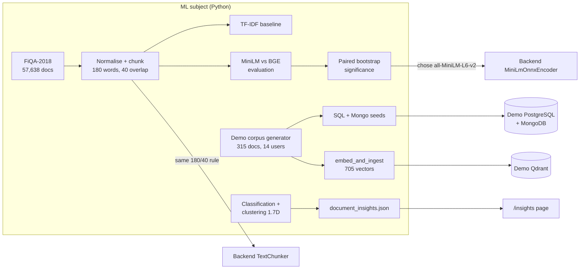

# Machine Learning in the Enterprise Knowledge Intelligence Platform

| | |
|---|---|
| **Course** | Machine Learning (25SC2107E) |
| **Folder** | [`subjects/ML/`](../../subjects/ML/) |
| **Owns** | Choosing and validating the embedding model behind semantic search, the text-chunking rules, the 315-document demo corpus, and document classification and clustering |
| **Used by the platform for** | The 384-d MiniLM model the backend runs for every semantic search and upload; the chunking every upload uses; the demo data; the **ML insights** page |
| **Language and tools** | Python 3.10, scikit-learn, ONNX Runtime, Hugging Face tokenizers, sentence-transformers (evaluation only) |

Semantic search, finding a document by what it *means*, is the platform's headline feature. The ML subject is why it can be trusted. Three questions had to be answered with evidence, not guesswork:

- which model turns text into vectors;
- how documents are cut into pieces;
- whether the Java code running that model in production gives the same answers as the Python model it was evaluated with.

The subject then went further and asked what *else* can be learned from the documents: can a model file a document into the right category, and do the documents group into meaningful clusters on their own?

---

## 1. Contributions at a glance



| # | Contribution | Where it ends up |
|---|---|---|
| 1 | Retrieval evaluation on a public benchmark, which picked the embedding model | The backend embeds every query and every uploaded chunk with `all-MiniLM-L6-v2` |
| 2 | Text normalisation and chunking (180-word windows, 40-word overlap) | The backend `TextChunker` uses the same parameters (`words-180-40`) |
| 3 | Proof that the Java ONNX encoder matches the Python model | Production semantic search returns the documents the evaluation measured |
| 4 | A deterministic 315-document demo corpus, with users, grants, test queries and real embeddings | The demo stack, the screenshots, the search and access experiments |
| 5 | Document classification and clustering, each evaluated (phase 1.7D) | The **ML insights** page at `/insights` |

---

## 2. Three corpora, three jobs

| Corpus | Size | Job | Owner |
|---|---|---|---|
| Seeded fixtures | 10 documents, 30 vectors | Deterministic database integration tests: they pin exact ids and counts | DBE-DSD |
| **FiQA-2018** (BEIR) | 57,638 documents, 648 test queries, 1,706 human relevance judgements | ML evaluation with ground truth nobody on the team wrote | ML |
| **Demo corpus** | 315 documents in 6 categories, 705 chunk vectors, 14 users, 60 grants, 32 queries | A realistic, searchable demo with owners and permissions | ML (generator) → DBE-DSD (demo stack) |

They are kept apart on purpose:

- **Fixtures vs everything else.** The integration tests assert exact results, for example "vector search returns ids 1 to 10". Mixing in other data would break tests that must stay frozen.
- **FiQA.** It is downloaded and preprocessed by a script rather than committed, which avoids redistributing CC-BY-SA content. Its document and judgement counts match the BEIR paper exactly, which confirms the loader reads the intended split.

---

## 3. Choosing the embedding model (phases 1.7B-1 and 1.7B-2)

### 3.1 Pipeline

1. **Load.** `src/preprocessing/dataset.py` streams FiQA from the BEIR release and writes canonical JSONL.
2. **Chunk.** `src/preprocessing/chunking.py` applies NFKC normalisation and cuts each document into **180-word windows with a 40-word overlap**, so a sentence near a boundary appears whole in at least one chunk. 57,638 documents become 76,723 chunks.
3. **Score.** `src/evaluation/metrics.py` computes Recall@K, MRR and nDCG@10. Chunk hits are collapsed to document hits, because relevance is judged per document.
4. **Baseline.** `src/ranking/tfidf_baseline.py` gives the score every model must beat: nDCG@10 = 0.1447 on the full corpus (BEIR reports BM25 at 0.236).

### 3.2 Comparison

Three retrievers were compared on a bounded, deterministic subset (150 queries, 7,087 chunks, seed 20260912), which runs in minutes on a CPU.

| Metric | TF-IDF | MiniLM-L6 | BGE-small |
|---|---|---|---|
| nDCG@10 | 0.3709 | 0.6240 | 0.6533 |
| MRR | 0.4182 | 0.7120 | 0.7322 |
| Recall@10 | 0.4617 | 0.6739 | 0.7089 |

**Significance.** A paired bootstrap over queries (10,000 iterations, `src/evaluation/significance.py`) gave:

- **Dense models vs TF-IDF:** dense is better; the 95% interval is [+0.198, +0.308] nDCG, p < 0.0001.
- **BGE vs MiniLM:** not significantly different. The difference is +0.029, with a 95% interval of [−0.008, +0.068], p = 0.138.

**Decision.** `all-MiniLM-L6-v2` (Apache-2.0):

- **Same quality.** The difference from BGE could be noise.
- **Faster and smaller.** MiniLM embeds 2.5× faster and its weights are 1.5× smaller, which matters for a backend that must fit in 512 MB on a free host.
- **No schema change.** Both models are natively 384-dimensional, so the Qdrant collection never had to change size.
- **Provisional.** The decision document records the choice as provisional, because the subset scores are inflated relative to the full corpus.

Decision records: [`DATASET_AND_MODEL_SELECTION.md`](../../subjects/ML/docs/DATASET_AND_MODEL_SELECTION.md), [`PHASE_1_7B_2_EVALUATION.md`](../../subjects/ML/docs/PHASE_1_7B_2_EVALUATION.md).

---

## 4. From the Python model to production Java

The backend runs the model **in-process** with ONNX Runtime, so there is no separate Python or GPU service to host. That is only safe if the Java code produces the vectors the evaluation measured.

1. **Tokenizer.** The Hugging Face `tokenizer.json` is loaded with DJL tokenizers.
2. **Inference.** ONNX Runtime executes `model.onnx` (Xenova's export of `sentence-transformers/all-MiniLM-L6-v2`).
3. **Pooling and normalisation.** Attention-mask-aware mean pooling, then L2 normalisation, so the dot product equals cosine similarity, the metric configured in Qdrant.

**Verification:**

| Check | Result |
|---|---|
| Java vs Python sentence-transformers, element-wise | Largest difference about 1.5 × 10⁻⁷; cosine 1.000000 |
| Retrieval equivalence: 32 demo queries against the 705-vector demo collection (`test_retrieval_equivalence.py`, `test_java_onnx_compat.py`) | Top-5 results **100% identical**, same documents in the same order |
| The ML subject's own ONNX encoder (`src/embeddings/onnx_minilm.py`) vs the Java encoder | Cosine 1.0, largest difference 3 × 10⁻⁸ |

On Render's free tier the encoder runs with one inference thread. Semantic search answers in 0.4–0.9 s there (see [DBE-DSD](../database/DBE-DSD.md)).

Architecture note: [`docs/architecture/ONNX_EMBEDDING.md`](../architecture/ONNX_EMBEDDING.md).

---

## 5. The demo corpus (`src/demo`)

| File | Role |
|---|---|
| `topics.py` | 21 topics across 6 departments, each with its own vocabulary and prose. A corpus from one template with swapped nouns would make every document a near neighbour of every other, and retrieval quality would be an artefact of the generator. |
| `corpus.py` | Seeded and deterministic: 15 versions of each topic (315 documents) that differ in specifics (year, system, threshold). Owners, 14 users and 60 permission grants make access control visible. |
| `emit.py` | Writes the corpus as PostgreSQL SQL and MongoDB JavaScript. The demo containers load them at start-up. Chunks are cut by the same `chunking.py`, so chunk boundaries cannot drift. |
| `embed_and_ingest.py` | Embeds every chunk with MiniLM and loads the 705 vectors into the demo Qdrant. |

The same command produces the same corpus, ids and permissions on any machine. The demo stack (`subjects/DBE-DSD/database/docker-compose.demo.yml`) runs on its own ports, separate from the test stack.

---

## 6. Document classification and clustering (phase 1.7D)

`python -m src.insights` runs both analyses on the demo corpus and writes `results/document_insights.json`. The frontend's **ML insights** page draws that file as charts.

### 6.1 The key finding about the data

Each of the 21 topics appears in 15 near-identical versions. After normalisation, word overlap (Jaccard) is **0.99 within a topic** and **0.09 across topics**. So:

- **For classification:** any split that puts versions of one topic on both sides measures memorisation. A random split scores **100%**. Every split in this phase is therefore *by topic*.
- **For clustering:** recovering the 21 topics is easy. The interesting question is whether clusters match the 6 *categories*.

### 6.2 Feature engineering

Every document becomes title + description + body. The "(A)" to "(O)" version marker is dropped, and every number becomes `0`, because figures say nothing about a category. Four feature sets are built as scikit-learn transformers. Vectorisers are fitted *inside* each training fold, so no held-out topic's vocabulary leaks.

| Feature set | Captures | Dimensions |
|---|---|---|
| `tfidf-word` | Word 1–2-grams, English stop words removed, sublinear TF | 2,527 |
| `tfidf-char` | Character 3–5-grams inside word boundaries | 10,346 |
| `minilm` | 384-d MiniLM embedding of the whole document | 384 |
| `combined` | `tfidf-char` reduced to 100 LSA dimensions (truncated SVD), joined with `minilm` | 484 |

### 6.3 Classification protocol

1. **Lock the test set.** One topic per category is locked away as the test set: 6 topics, 90 documents.
2. **Tune by topic.** On the other 15 topics, each feature set × model is tuned with **leave-one-topic-out** validation: logistic regression, linear SVM, k-NN, multinomial Naive Bayes (TF-IDF only) and random forest.
   - Grid search is used, except randomised search for the forest.
   - Folds are scored by accuracy: a one-topic fold contains one category, so macro-F1 per fold is undefined.
3. **Test once.** The best pair is refitted on all 15 topics and evaluated **once** on the locked set.
4. **Repeat across all topics.** Leave-one-topic-out is repeated over all 21 topics, because 6 test topics are a small sample.
5. **Check the leak.** The same model is run under an ordinary stratified 5-fold split, to show how a random split leaks.
6. **Check calibration.** Four model types are compared on how well their stated confidence matches their accuracy.

**Results.** The best model is **character TF-IDF + Naive Bayes, α = 0.1**.

| Evaluation | Accuracy | Macro-F1 |
|---|---|---|
| Ordinary random split (leaks) | 1.00 | — |
| **Locked test set, 6 unseen topics** | **0.83** | **0.78** |
| Every topic held out in turn (21 topics) | 0.57 (12 of 21 topics right) | 0.55 |
| Chance (largest category) | 0.19 | — |

**Reading the results.**

- **The single miss.** Every Finance test document (an expenses policy) was filed as Administration; the other five categories were perfect.
- **Neighbouring-area misses.** Across all 21 topics, misses go to a neighbouring business area. For example, budget and procurement policies are filed as HR, and the security-awareness standard as Legal.
- **What it means.** The six categories are organisational, not topical, and that limits what any text classifier can do. Still, 0.57 is well above chance (0.19), and the 1.00 from a random split is memorisation, not skill.

**Hyperparameter tuning:** grid vs random search on the chosen model.

| Search | Candidates | Fits | Best α | Validation accuracy |
|---|---|---|---|---|
| Grid {0.01, 0.1, 1} | 3 | 45 | 0.1 | 0.60 |
| Random, log-uniform (0.001, 10) | 10 | 150 | 0.151 | 0.60 |

**Calibration:** out-of-fold probabilities, with each topic held out.

| Model (features) | Accuracy | Mean confidence | ECE | Brier |
|---|---|---|---|---|
| Logistic regression (MiniLM) | 0.49 | 0.51 | 0.198 | 0.643 |
| Naive Bayes (word TF-IDF) | 0.48 | **0.69** | 0.217 | 0.632 |
| Random forest (MiniLM) | 0.31 | 0.29 | **0.063** | 0.796 |
| Linear SVM + Platt scaling (MiniLM) | 0.40 | 0.49 | 0.147 | 0.775 |

- **Naive Bayes is overconfident:** 0.69 confidence for 0.48 accuracy, the usual result of its independence assumption.
- **The random forest is the best calibrated, but the least accurate.**

### 6.4 Clustering

**Choosing k on the MiniLM embeddings** (k = 2 to 30):

- The elbow of the within-cluster sum of squares is at **k = 17**.
- The best silhouette is at **k = 24 (0.971)**, near the 21 topics.

**Random vs k-means++ initialisation** (20 single-start runs each):

| k | Initialisation | Mean inertia | Topic ARI |
|---|---|---|---|
| 6 | random | 157.3 ± 7.3 | 0.31 |
| 6 | k-means++ | 146.5 ± 2.6 | 0.33 |
| 24 | random | 30.6 ± 10.1 | 0.79 |
| 24 | k-means++ | **4.1 ± 0.3** | **0.98** |

With many small clusters, random starts often put two centroids in one topic and none in another; k-means++ spreads the first centroids out.

**Algorithms at k = 6** (do the clusters match the categories?):

| Algorithm | ARI | NMI | Silhouette |
|---|---|---|---|
| K-means on PCA (17 components, 90% of the variance) | **0.60** | 0.72 | 0.41 |
| K-means, k-means++ | 0.58 | 0.71 | 0.36 |
| Mini-batch k-means | 0.49 | 0.68 | 0.36 |
| K-means on LSA (word TF-IDF) | 0.45 | 0.61 | 0.28 |
| Agglomerative, Ward | 0.41 | 0.60 | 0.38 |
| Agglomerative, complete / average link | 0.36 | 0.62 | 0.39 |
| K-means, random init | 0.32 | 0.60 | 0.35 |
| Agglomerative, single link | 0.29 | 0.56 | 0.37 |

- **DBSCAN** (`min_samples = 5`, cosine distance; eps = 0.030 from the knee of the sorted 5th-neighbour distance) found **21 clusters, one per topic, without being told k**. It left 11 documents as noise; topic ARI 0.98.
- **PCA** needs 17 of 384 dimensions to keep 90% of the variance. The first two keep only 25%, so the page draws its 2-D map with **t-SNE** (perplexity 30, cosine).
- **Themes.** Each cluster is described by the words whose TF-IDF most exceeds the corpus average. Two of the six k = 6 clusters are pure (Technical, Research). The others mix categories. For example, onboarding and remote-working (HR) group with office facilities (Administration), around words such as *access*, *workstation* and *pass*.

### 6.5 The ML insights page (`/insights`)

The React page has three tabs and draws everything in plain SVG, with no chart library:

- **Classification:** the leakage comparison, the model-selection bars, the locked-test confusion matrix and per-category scores, every topic held out, tuning, and calibration curves.
- **Clustering:** choosing k, initialisation, the algorithm comparison, DBSCAN, themes, and small-multiple t-SNE maps per category.
- **Data and method:** the corpus facts and the protocol.

The chart palette was validated for colour-blind separation and contrast on both light and dark surfaces.

Full write-up: [`DOCUMENT_CLASSIFICATION_AND_CLUSTERING.md`](../../subjects/ML/docs/DOCUMENT_CLASSIFICATION_AND_CLUSTERING.md).

---

## 7. How the course topics map to the project

| Course topic | Where it appears |
|---|---|
| Data preparation and feature engineering | NFKC normalisation, chunking, the version-marker and number normalisation, four feature sets (word and character TF-IDF, embeddings, LSA) |
| Supervised learning | Logistic regression, linear SVM, k-NN, multinomial Naive Bayes and random forest for category classification |
| Model evaluation | Locked test set, leave-one-topic-out, leakage demonstration, accuracy and macro/weighted F1, confusion matrices; Recall@K, MRR, nDCG for retrieval; paired-bootstrap significance tests |
| Hyperparameter tuning | Grid and randomised search with grouped cross-validation |
| Calibration | Reliability bins, ECE, Brier score and log loss; Platt scaling for the SVM |
| K-means, k-means++ and mini-batch k-means | Choosing k by elbow and silhouette, random vs k-means++ initialisation, mini-batch comparison |
| DBSCAN and agglomerative clustering | DBSCAN with eps from the k-distance knee; single, complete, average and Ward linkage |
| Dimensionality reduction | PCA (variance explained, k-means on PCA), truncated SVD / LSA, t-SNE maps |
| Embeddings and representation learning | MiniLM vs BGE vs TF-IDF retrieval evaluation, chosen for production |

---

## 8. Tests

| Test | Checks |
|---|---|
| `tests/test_pipeline.py` | 15 checks, no network: normalisation, chunk windows and overlap, Recall@K, reciprocal rank, nDCG, chunk-to-document collapse, and that the evaluation subset is deterministic and keeps every relevant document |
| `tests/test_embeddings.py` | 4 structural checks, plus 2 behavioural checks with the real models (`--with-models`) |
| `tests/test_document_insights.py` | 6 checks: normalisation, locked topics, no topic in both a training and a validation fold, knee detection, the encoder, consistency of the results file |
| `tests/test_java_onnx_compat.py`, `tests/test_retrieval_equivalence.py` | Python vs Java vectors, and identical top-5 retrieval on the demo stack |
| `tests/test_demo_qdrant.py` | The demo collection exists with 705 vectors of 384 dimensions, and every payload is intact |

```bash
cd subjects/ML
pip install -r requirements.txt
python -m src.preprocessing.dataset         # fetch FiQA (about 28 MB)
python -m src.ranking.tfidf_baseline        # baseline
python -m src.evaluation.compare --subset   # model comparison
python -m src.evaluation.significance       # paired bootstrap
python -m src.insights --frontend ../DBE-DSD/frontend/src/data/mlInsights.json
python tests/test_pipeline.py && python tests/test_document_insights.py
```

---

## 9. Limitations and future work

- **Provisional model choice.** BGE and MiniLM could not be told apart on the subset; a full-corpus run would settle it.
- **Small, synthetic data for 1.7D.** 21 topics are few independent examples, and per-topic results are close to all-or-nothing. The corpus is synthetic, so the numbers show the methods working, not how they would score on a company's real documents.
- **UMAP** is in the syllabus but was not used (`umap-learn` is not installed); PCA and t-SNE cover visualisation.
- **Not yet served.** Classification and clustering results are displayed, not used live. Suggesting a category when a document is uploaded is the natural next step.
- **No learned ranking.** Search ranking uses a fixed weighted fusion (0.4 keyword, 0.6 vector). Learning the weights from click or relevance data is future work.
- **Stale README line.** The folder's [README](../../subjects/ML/README.md) still says "no Qdrant vector has been written … no Spring code has changed". That was true at phase 1.7B-2; the demo vectors and the Java encoder came later.
