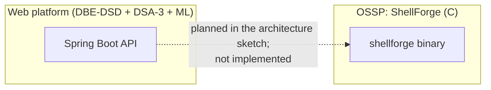
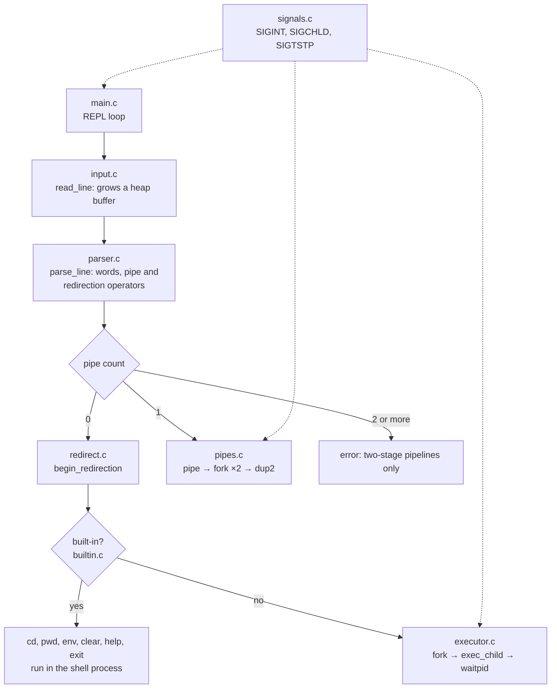

# OSSP in the Enterprise Knowledge Intelligence Platform

| | |
|---|---|
| **Course** | Operating Systems and Systems Programming (25CS2104E) |
| **Folder** | [`subjects/OSSP/shellforge/`](../../subjects/OSSP/shellforge/) |
| **Owns** | **ShellForge**, a Unix shell written in C, built week by week through the course handbook |
| **Status** | Weeks 1–9 implemented (version 9.0). 148 automated checks across Weeks 4–9 pass when built and run in a `gcc:13` Docker container. |
| **Relationship to the platform** | A separate component in the same repository. It is **not** called by the web platform today (see section 1). |

ShellForge is the project's systems-programming part: a working shell that reads commands, parses them, starts processes, runs built-ins, handles signals, connects commands with pipes and redirects input and output. Each feature is built directly on POSIX system calls, which is what the course is about.

---

## 1. How OSSP relates to the rest of the platform

The project's original architecture sketch ([`PROJECT_ARCHITECTURE.md`](../architecture/PROJECT_ARCHITECTURE.md)) shows the Spring Boot API calling ShellForge as a Linux administration shell. **That link has not been built.** ShellForge is compiled and tested on its own, and nothing in the backend or frontend calls it. This document describes what ShellForge is, and separately (section 6) where operating-system ideas from the course show up in the platform's own engineering.



---

## 2. Architecture of ShellForge



| Module | Responsibility |
|---|---|
| `main.c` | The REPL: banner, prompt, read, parse, dispatch, free; `--debug-tokens` and `--demo-ipc` flags |
| `input.c` | `read_line()`: a heap buffer that doubles with `realloc` as input grows; never truncates |
| `parser.c` | `parse_line()`: splits the line in place into a NULL-terminated `argv`, recognises `\|`, `<`, `>`, `>>` and `2>` with or without spaces; the vector grows 64 → 128 → … |
| `executor.c` | `execute_command()`, `exec_child()` (the one place children reset signals, apply redirections and `execvp`), `wait_child()` |
| `builtin.c` | `cd`, `pwd`, `env`, `clear`, `help`, `exit`, run inside the shell process |
| `signals.c` | `sigaction` handlers, SIGCHLD blocking around foreground waits, child signal reset |
| `pipes.c` | Two-stage pipelines and the IPC demonstration |
| `redirect.c` | `apply_redirections()` (in a child) and `begin_/end_redirection()` (in the shell, for built-ins) |

---

## 3. Week by week

| Week | Topic | What ShellForge gained | Course outcome |
|---|---|---|---|
| 1 | REPL and build | Prompt loop, banner, `exit`, Makefile, source/header layout; compiles with no warnings under `-Wall -Wextra` | CO1 |
| 2 | C toolchain and memory | `read_line()` with `malloc`/`realloc`/`free`; a 3,000-character line arrives intact; no leaks under AddressSanitizer | CO1, CO4 |
| 3 | Parser | Tokens into a growing, NULL-terminated `argv` in the shape `execvp` expects; extra spaces and empty lines handled | CO1 |
| 4 | Processes | `fork()`, `execvp()` with PATH search, `waitpid()`; exit codes and the signal that ended a child (`WIFEXITED`, `WEXITSTATUS`, `WIFSIGNALED`); `_exit()` after a failed exec; stdio flushed before `fork()` | CO2 |
| 5 | Built-ins and environment | `cd` (via `chdir`, defaulting to `$HOME`), `pwd` (`getcwd`), `env`, `clear`, `help`, `exit`, all run *in* the shell because a child's `chdir` dies with the child; `PWD` kept in step | CO2 |
| 6 | Signals and process control | Ctrl+C ends the running command but not the shell; finished children are reaped so no zombies remain; Ctrl+Z ignored until job control exists | CO2, CO3 |
| 7 | Pipes and IPC | `cmd1 \| cmd2` with `pipe()` and `dup2()`; every unused descriptor closed so the reader sees end-of-file; a `demo-ipc` command shows parent→child and child→parent messages and EOF | CO3 |
| 8 | Memory, Valgrind and GDB | A full session runs clean under Valgrind and AddressSanitizer; a scripted GDB session; `make asan` and `make valgrind`; review fixes | CO4 |
| 9 | File descriptors and redirection | `>`, `>>`, `<` and `2>` with `open()` flags and `dup2()`; works on built-ins and inside pipelines | CO5 |

### Week 6: signals in detail

- **`sigaction` with `SA_RESTART`.** A Ctrl+C at the prompt would otherwise interrupt the `read()` underneath `getchar()` and look like end-of-input.
- **SIGINT.** The terminal sends Ctrl+C to the whole foreground process group. The running child dies with the default action, and the shell's handler prints a newline and continues. At an idle prompt the handler prints `ShellForge: type 'exit' to quit.` and a fresh prompt.
- **SIGCHLD reaper.** `while (waitpid(-1, NULL, WNOHANG) > 0);`, looping because signals don't queue, with `errno` saved and restored.
- **A race in the handbook's version, fixed.** The handbook's reaper could collect the *foreground* child before the shell's own `waitpid()` did, losing its exit status. ShellForge blocks SIGCHLD with `sigprocmask` from just before `fork()` until its `waitpid()` returns.
- **Child reset.** Before `execvp`, each child restores default signal actions and unblocks SIGCHLD. A blocked mask and ignored signals both survive `exec`.
- **Async-signal safety.** The handlers use `write()`, not `printf()`, which is unsafe inside a handler.

### Week 7: pipes in detail

- **Order of operations.**
  1. The parent calls `pipe()` and forks twice.
  2. Child 1 makes the write end its stdout with `dup2`; child 2 makes the read end its stdin.
  3. Every unused end is closed in each process.
- **The critical rule.** The parent must close *both* ends, or the reader never sees end-of-file and waits forever.
- **Exit status.** The pipeline's exit status is the last command's.

### Week 8: memory work in detail

- **Valgrind.** A full session went through every path that allocates or opens something: a 1,500-character line, a 150-argument line, every built-in, a missing command, pipes, all redirections, failed opens, syntax errors and the IPC demo. Result: **58 allocations, 58 frees, 0 errors**.
- **Controls.** A deliberate 200-byte leak *is* reported by Valgrind, and a deliberate heap-buffer overflow *is* reported by ASan with its source line. So the clean results mean something.
- **GDB.** A scripted session breaks in `parse_line`, prints the backtrace into `main`, and inspects the token vector down to its NULL terminator.
- **Fixes from the review.**
  - `errno` is now saved before `fprintf` can change it.
  - A pipeline no longer reads an exit status that `waitpid` might not have set.
  - Three copies of the child set-up code were merged into one `exec_child()`.

### Week 9: redirection in detail

| Operator | `open()` flags |
|---|---|
| `> file` | `O_WRONLY \| O_CREAT \| O_TRUNC`, mode 0644 |
| `>> file` | `O_WRONLY \| O_CREAT \| O_APPEND`, mode 0644 |
| `< file` | `O_RDONLY` |
| `2> file` | stderr, `O_WRONLY \| O_CREAT \| O_TRUNC`, mode 0644 |

- **Built-ins.** For built-ins (`pwd > file`), the shell saves file descriptors 0–2 with `fcntl(F_DUPFD_CLOEXEC)`, redirects, runs the built-in and restores them. The saved copies are close-on-exec, so they never leak into programs the shell starts.
- **Inside pipelines.** Each side's redirections are applied in its own child after the pipe is connected, so `sort < in | head -1 > out` works.
- **The `2>` rule.** `2>` is recognised only when the `2` stands alone, as in `sh`: `echo a2>f` means the word `a2` written to `f`.

**Where ShellForge deliberately differs from the handbook listings:**

- **Signal handlers** use `write()` instead of `printf()`.
- **The SIGCHLD reaper** is fenced off from foreground waits, so it can't take their exit status.
- **Redirection** implements all four operators. The listing implements only `>` and `>>`, and skips built-ins.

Each difference is explained in the week's document.

---

## 4. Testing

The host is Windows, so ShellForge is built and tested in a `gcc:13` container. Valgrind and GDB come from an image that adds them (see [`tests/TESTS.md`](../../subjects/OSSP/shellforge/tests/TESTS.md)).

```bash
cd subjects/OSSP/shellforge
docker run --rm -v "$(pwd):/src" -w /src gcc:13 sh -c "make clean && make test"
```

| Suite | Chapter | Checks |
|---|---|---|
| `test_week4.sh` | Processes and command execution | 21 |
| `test_week5.sh` | Built-ins and environment variables | 32 |
| `test_week6.sh` | Signals and process control | 21 |
| `test_week7.sh` | Pipes and IPC | 23 |
| `test_week8.sh` | Valgrind, GDB and AddressSanitizer | 22 (11 are reported as skipped where Valgrind or GDB is missing) |
| `test_week9.sh` | File descriptors and redirection | 29 |
| **Total** | | **148** |

- **Simulating Ctrl+C and Ctrl+Z.**
  - The shell runs in its own process group under `setsid`, and the test signals the whole group the way a terminal does.
  - A Ctrl+C during `sleep 5` ends the sleep in about 2 s while the shell carries on.
  - After Ctrl+Z, no process is left in the stopped state.
- **Zombie reaping.** `tests/sigchld_check.c` shows a child left unreaped is a zombie (`Z` in `/proc`) without the handler, and is gone with it.
- **Descriptor leaks.** After redirections and a pipe, a child sees only descriptors 0–3. Building with `F_DUPFD` instead of `F_DUPFD_CLOEXEC` makes this test fail, listing the leaked descriptors 10, 11 and 12: proof that the test catches the bug.
- **Sanitizers.** Every suite also runs under AddressSanitizer and UndefinedBehaviorSanitizer and expects no report.

---

## 5. How the course outcomes map to ShellForge

| Course outcome | Covered by | Not yet covered |
|---|---|---|
| CO1: the OS as layered services; user vs kernel mode; the system-call interface; the shell as a user-space program | Weeks 1–3: the shell itself, reading input and parsing commands into the form `execvp` needs | — |
| CO2: process control with fork, exec, wait and exit | Weeks 4–6: process creation, exec, waiting and reaping, exit statuses, built-ins in the parent | Job control: background `&`, `jobs`, `fg`/`bg`, process groups per job |
| CO3: IPC with pipes, FIFOs, Unix domain sockets, signals and shared memory | Week 6 signals; Week 7 anonymous pipes and the IPC demo | Named pipes (FIFOs), Unix domain sockets, shared memory |
| CO4: virtual memory, paging, page faults, copy-on-write | Weeks 2 and 8: heap management and memory debugging with Valgrind, GDB and ASan | Demonstrations of paging, page faults, `mmap` and copy-on-write |
| CO5: file systems, inodes, directories, file-I/O system calls | Week 9: `open`, `close`, `dup2`, file creation flags and permissions | Directory operations, inodes, `read`/`write`/`lseek` on structured data |
| CO6: POSIX threads, mutexes, condition variables, semaphores | — | Not started: no handbook chapter has covered threads yet |

---

## 6. Where operating-system ideas show up in the platform

These are not ShellForge code. They are places where the web platform's own engineering needed the same ideas the course teaches.

| OS idea | In the platform |
|---|---|
| Processes and isolation | Every service runs in its own container. The backend runs as a non-root user. Health checks gate start-up order. |
| Memory limits | On Render's 512 MB free tier the unchanged backend was killed for running out of memory. It now fits by capping the Java heap at 128 MB, limiting glibc malloc arenas (`MALLOC_ARENA_MAX=2`) and loading pre-built class data. Steady state is 446 MiB, with a 485 MiB peak. |
| Threads and CPU scheduling | ONNX Runtime started one busy-waiting thread per host core and used up the 0.1-CPU quota. It now runs with a single inference thread. Request threads are capped at 16 and database connections at 4. |
| Lock contention | Under load, thread dumps showed request threads queued on one lock: the JWT parser was being rebuilt for every token. Building it once raised throughput from 149 to 181 requests per second. |
| File descriptors and I/O limits | Upload size is enforced in the service, in Spring's multipart settings and in nginx. Unzipping a Word file stops at 64 MB to defeat zip bombs. |

---

## 7. Key files

| Path | What it is |
|---|---|
| `shellforge/src/*.c`, `shellforge/include/*.h` | The shell |
| `shellforge/Makefile` | `make`, `make run`, `make test`, `make asan`, `make valgrind` |
| `shellforge/docs/WEEK1.md` … `WEEK9.md` | One write-up per handbook chapter, including design decisions and differences from the handbook |
| `shellforge/docs/OSSP_MAPPING.md` | Weeks mapped to course outcomes |
| `shellforge/tests/` | `test_week4.sh` … `test_week9.sh`, `sigchld_check.c`, `TESTS.md` |
