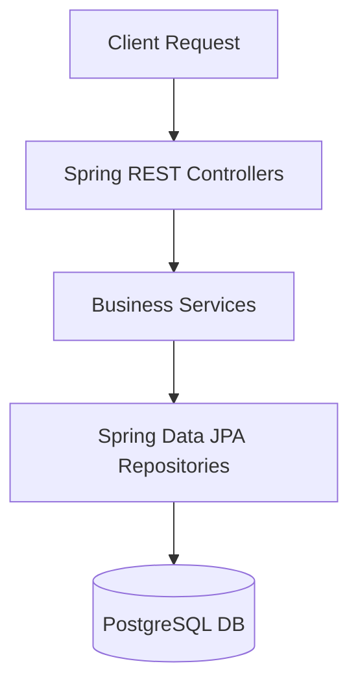

# Backend Architecture

```mermaid
flowchart TD
    Client[Client Request] --> Controller[Spring REST Controllers]
    Controller --> Service[Business Services]
    Service --> Repository[Spring Data JPA Repositories]
    Repository --> Postgres[(PostgreSQL DB)]
```

*Note: MongoDB and Qdrant are intentionally not connected during this milestone. PostgreSQL remains the sole source of truth for the relational architecture.*
