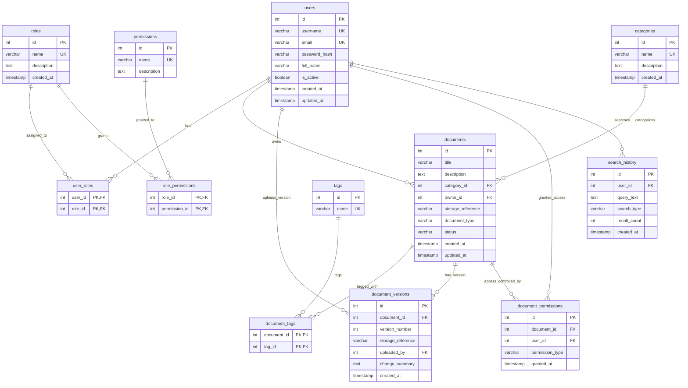

# Entity-Relationship Diagram

```mermaid
erDiagram
    users {
        int id PK
        varchar username UK
        varchar email UK
        varchar password_hash
        varchar full_name
        boolean is_active
        timestamp created_at
        timestamp updated_at
    }
    
    roles {
        int id PK
        varchar name UK
        text description
        timestamp created_at
    }
    
    permissions {
        int id PK
        varchar name UK
        text description
    }
    
    user_roles {
        int user_id PK, FK
        int role_id PK, FK
    }
    
    role_permissions {
        int role_id PK, FK
        int permission_id PK, FK
    }
    
    categories {
        int id PK
        varchar name UK
        text description
        timestamp created_at
    }
    
    documents {
        int id PK
        varchar title
        text description
        int category_id FK
        int owner_id FK
        varchar storage_reference
        varchar document_type
        varchar status
        timestamp created_at
        timestamp updated_at
    }
    
    tags {
        int id PK
        varchar name UK
    }
    
    document_tags {
        int document_id PK, FK
        int tag_id PK, FK
    }
    
    document_versions {
        int id PK
        int document_id FK
        int version_number
        varchar storage_reference
        int uploaded_by FK
        text change_summary
        timestamp created_at
    }
    
    document_permissions {
        int id PK
        int document_id FK
        int user_id FK
        varchar permission_type
        timestamp granted_at
    }
    
    search_history {
        int id PK
        int user_id FK
        text query_text
        varchar search_type
        int result_count
        timestamp created_at
    }
    
    users ||--o{ user_roles : "has"
    roles ||--o{ user_roles : "assigned_to"
    
    roles ||--o{ role_permissions : "grants"
    permissions ||--o{ role_permissions : "granted_to"
    
    users ||--o{ documents : "owns"
    categories ||--o{ documents : "categorizes"
    
    documents ||--o{ document_tags : "tagged_with"
    tags ||--o{ document_tags : "tags"
    
    documents ||--o{ document_versions : "has_version"
    users ||--o{ document_versions : "uploads_version"
    
    documents ||--o{ document_permissions : "access_controlled_by"
    users ||--o{ document_permissions : "granted_access"
    
    users ||--o{ search_history : "searches"
```
